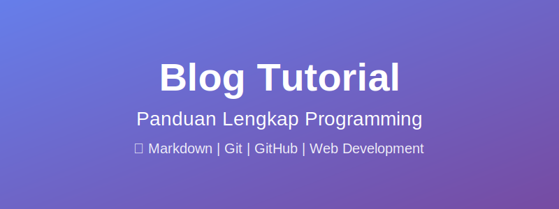
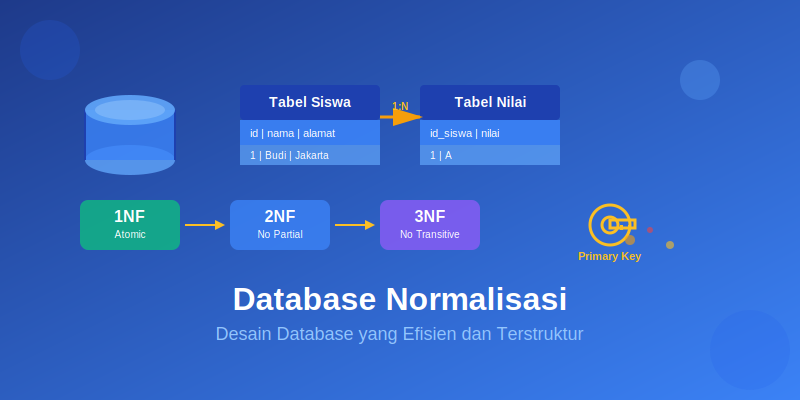
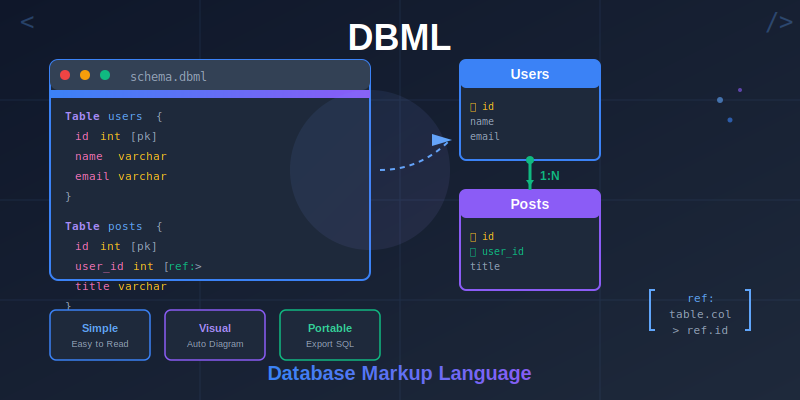

# Blog Tutorial dan Panduan

Selamat datang di blog tutorial! Di sini Anda akan menemukan berbagai artikel panduan dan tutorial pemrograman.

---

## 📚 Daftar Artikel

### [Markdown: Pengertian, Fungsi, dan Panduan Lengkap](pages/apa-itu-markdown.md)

Pelajari segala hal tentang Markdown, bahasa markup ringan yang sangat populer di kalangan programmer dan content creator. Artikel ini membahas:

- **Pengertian Markdown** - Apa itu Markdown dan mengapa penting?
- **Sejarah Markdown** - Diciptakan oleh John Gruber pada tahun 2004
- **Kelebihan Markdown** - Mudah dipelajari, ringan, portable, dan mudah dikonversi
- **Struktur Dasar** - Heading, paragraf, dan sintaks dasar lainnya
- **Penggunaan** - Dokumentasi proyek, README GitHub, blog statis, dan lainnya

Cocok untuk pemula yang ingin memulai menulis dokumentasi atau content dengan format yang clean dan mudah dibaca.

**📖 [Baca Selengkapnya →](pages/apa-itu-markdown.md)**

---

### [Tutorial Membuat Aplikasi CRUD Data Mahasiswa dengan Express.js dan Handlebars](pages/tutorial-membuat-aplikasi-crud-data-mahasiswa-dengan-expressjs-dan-handlebars.md)

Tutorial lengkap step-by-step untuk membuat aplikasi web CRUD (Create, Read, Update, Delete) menggunakan stack modern Node.js. Artikel ini mencakup:

- **Persiapan dan Instalasi** - Setup Node.js, npm, dan tools yang dibutuhkan
- **Inisialisasi Project** - Membuat struktur project Node.js
- **Express.js** - Framework web populer untuk Node.js
- **Handlebars** - Template engine untuk rendering HTML dinamis
- **SQLite** - Database ringan untuk menyimpan data mahasiswa
- **Implementasi CRUD** - Halaman tambah, edit, hapus, dan tampil data

Tutorial ini cocok untuk mahasiswa atau developer pemula yang ingin belajar membuat aplikasi web full-stack dengan Node.js.

**📖 [Baca Selengkapnya →](pages/tutorial-membuat-aplikasi-crud-data-mahasiswa-dengan-expressjs-dan-handlebars.md)**

---

### [Tutorial Git dan GitHub untuk Pemula](pages/tutorial-git-dan-github.md)

Panduan lengkap untuk memulai dengan Git dan GitHub, dari instalasi hingga workflow profesional. Tutorial komprehensif ini mencakup:

- **Pengenalan Git dan GitHub** - Apa itu version control dan mengapa penting?
- **Instalasi dan Konfigurasi** - Setup Git di Windows, Mac, dan Linux
- **Perintah Dasar Git** - init, add, commit, push, pull, dan lainnya
- **Membuat Repository** - Setup repository lokal dan GitHub
- **Workflow Git** - Alur kerja sehari-hari yang efisien
- **Branching dan Merging** - Manajemen branch untuk kolaborasi tim
- **Best Practices** - Tips commit message, .gitignore, dan praktik terbaik lainnya

Tutorial ini sangat cocok untuk pemula yang baru belajar programming atau developer yang ingin meningkatkan skill version control mereka.

**📖 [Baca Selengkapnya →](pages/tutorial-git-dan-github.md)**

---

### [Tutorial Mengaktifkan GitHub Pages](pages/tutorial-mengaktifkan-github-pages.md)

Panduan praktis untuk mempublikasikan website statis Anda secara gratis menggunakan GitHub Pages. Tutorial ini membahas:

- **Pengenalan GitHub Pages** - Layanan hosting gratis dari GitHub
- **Keuntungan GitHub Pages** - Gratis, mudah, custom domain, HTTPS otomatis
- **Langkah-langkah Aktivasi** - Cara mengaktifkan dan konfigurasi GitHub Pages
- **Deploy dari Branch** - Setup deployment dari branch main atau master
- **Deploy dengan GitHub Actions** - Otomasi deployment untuk static site generator
- **Custom Domain** - Cara menghubungkan domain kustom Anda
- **Troubleshooting** - Solusi masalah umum yang sering terjadi

Cocok untuk siapa saja yang ingin meng-host portfolio, blog, dokumentasi, atau website statis lainnya tanpa biaya hosting.

**📖 [Baca Selengkapnya →](pages/tutorial-mengaktifkan-github-pages.md)**

---

### [Tutorial Database: Normalisasi dan Relasi](pages/tutorial-database-normalisasi-dan-relasi.md)

Panduan lengkap untuk memahami konsep normalisasi database dan relasi antar tabel. Tutorial komprehensif ini mencakup:

- **Pengantar Database** - Konsep dasar database relasional dan pentingnya normalisasi
- **Normalisasi Database** - Proses mengorganisir data untuk mengurangi redundansi
- **First Normal Form (1NF)** - Nilai atomik dan eliminasi grup berulang dengan contoh
- **Second Normal Form (2NF)** - Menghilangkan partial dependency pada composite key
- **Third Normal Form (3NF)** - Menghapus transitive dependency antar atribut
- **Boyce-Codd Normal Form (BCNF)** - Versi lebih ketat dari 3NF untuk kasus khusus
- **Contoh Proses Normalisasi** - Step-by-step dari tabel tidak normal hingga 3NF
- **Relasi One-to-One (1:1)** - Hubungan satu ke satu dengan contoh Siswa dan KTP
- **Relasi One-to-Many (1:N)** - Hubungan satu ke banyak dengan contoh Dosen dan Mata Kuliah
- **Relasi Many-to-Many (M:N)** - Junction table untuk relasi banyak ke banyak
- **Implementasi SQL** - Schema database sistem akademik lengkap dengan foreign keys
- **Contoh Query** - JOIN operations, agregasi, dan query kompleks
- **Entity Relationship Diagram (ERD)** - Visualisasi relasi antar tabel
- **Best Practices** - Indexing, foreign key constraints, naming convention, denormalisasi
- **Latihan Soal** - Praktik identifikasi pelanggaran normalisasi dan desain schema

Tutorial ini sangat cocok untuk mahasiswa informatika, database administrator, dan developer yang ingin menguasai desain database yang efisien, scalable, dan mudah dimaintain.

**📖 [Baca Selengkapnya →](pages/tutorial-database-normalisasi-dan-relasi.md)**

---

### [Tutorial DBML (Database Markup Language): Desain Database dengan Mudah](pages/tutorial-dbml-database-markup-language.md)

Panduan lengkap untuk menguasai DBML, bahasa markup modern untuk mendefinisikan dan mendokumentasikan struktur database. Tutorial ini mencakup:

- **Pengantar DBML** - Apa itu Database Markup Language dan keuntungannya
- **Perbandingan SQL vs DBML** - Lebih simple, readable, dan maintainable
- **Syntax Dasar DBML** - Struktur file, komentar, dan elemen-elemen dasar
- **Mendefinisikan Tabel** - Table definition dengan schema, aliases, dan notes
- **Tipe Data dan Constraints** - INTEGER, VARCHAR, TEXT, DATE dengan pk, unique, not null
- **Column Settings** - Primary key, foreign key, default values, auto increment
- **Mendefinisikan Relasi** - One-to-One (1:1), One-to-Many (1:N), Many-to-Many (M:N)
- **Relationship Syntax** - Inline references dan separate Ref blocks
- **Indexes** - Single column, composite index, dan index types (btree, hash)
- **Enum Types** - Type-safe status dan category definitions
- **Table Groups** - Organize tables untuk dokumentasi yang lebih baik
- **Tools dan Platform** - dbdiagram.io, DBML CLI, VS Code extensions
- **Export ke SQL** - Convert ke PostgreSQL, MySQL, SQL Server, SQLite
- **Contoh Project E-Commerce** - Complete schema dengan users, products, orders
- **Best Practices** - Naming conventions, documentation, version control
- **Integration** - Git workflow, CI/CD, dan team collaboration

Tutorial ini sangat cocok untuk database designers, backend developers, dan tim yang ingin improve database development workflow dengan dokumentasi yang readable dan maintainable.

**📖 [Baca Selengkapnya →](pages/tutorial-dbml-database-markup-language.md)**

---

_Terakhir diupdate: 31 Maret 2026_
