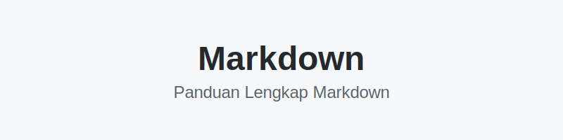

# Markdown: Pengertian, Fungsi, dan Panduan Lengkap untuk Pemula hingga Mahir



> **Panduan Komprehensif tentang Markdown** - Dari konsep dasar hingga penggunaan advanced untuk dokumentasi profesional

---

## 📑 Daftar Isi

1. [Pendahuluan](#1-pendahuluan)
2. [Sejarah Markdown](#2-sejarah-markdown)
3. [Mengapa Harus Belajar Markdown?](#3-mengapa-harus-belajar-markdown)
4. [Kelebihan dan Kekurangan Markdown](#4-kelebihan-dan-kekurangan-markdown)
5. [Struktur Dasar Markdown](#5-struktur-dasar-markdown)
6. [Formatting Teks](#6-formatting-teks)
7. [List dan Checklist](#7-list-dan-checklist)
8. [Link dan Gambar](#8-link-dan-gambar)
9. [Tabel di Markdown](#9-tabel-di-markdown)
10. [Code dan Syntax Highlighting](#10-code-dan-syntax-highlighting)
11. [Blockquote dan Callout](#11-blockquote-dan-callout)
12. [Advanced Markdown](#12-advanced-markdown)
13. [Markdown untuk Programmer](#13-markdown-untuk-programmer)
14. [Tools dan Editor Markdown](#14-tools-dan-editor-markdown)
15. [Best Practices](#15-best-practices)
16. [Kesimpulan](#16-kesimpulan)

---

## 1. Pendahuluan

### 1.1 Apa itu Markdown?

**Markdown** adalah bahasa markup ringan (_lightweight markup language_) yang digunakan untuk memformat teks secara sederhana, cepat, dan efisien. Berbeda dengan HTML yang menggunakan tag kompleks, Markdown menggunakan simbol-simbol sederhana yang mudah diingat dan ditulis.

**Filosofi Markdown**: "Easy to write, easy to read"

Markdown dirancang dengan prinsip bahwa dokumen yang ditulis dalam format plaintext tetap harus mudah dibaca bahkan tanpa di-render. Artinya, ketika Anda membuka file `.md` di notepad biasa, Anda masih bisa memahami struktur dan konten dokumen tersebut.

### 1.2 Perbedaan Markdown vs Markup Language Lain

**Perbandingan Syntaks:**

| Format   | Cara Menulis Heading    |
| -------- | ----------------------- |
| HTML     | `<h1>Judul Besar</h1>`  |
| LaTeX    | `\section{Judul Besar}` |
| Markdown | `# Judul Besar`         |

Dari tabel di atas terlihat jelas bahwa Markdown jauh lebih sederhana dan intuitif.

### 1.3 Penggunaan Markdown dalam Kehidupan Sehari-hari

Markdown bukan hanya untuk programmer! Markdown digunakan di berbagai bidang:

#### 📚 Dunia Pendidikan

- **Catatan kuliah** - Dosen dan mahasiswa menggunakan Markdown untuk mencatat materi
- **Tugas dan laporan** - Menulis laporan lab atau paper dengan format yang rapi
- **Slide presentasi** - Tools seperti Marp, reveal.js menggunakan Markdown untuk membuat slide

#### 💻 Dunia Programming

- **README.md** - File utama di setiap repository GitHub untuk menjelaskan proyek
- **Dokumentasi API** - Swagger, Postman, dan tools API documentation
- **Wiki internal** - Knowledge base perusahaan
- **Issue tracking** - GitHub Issues, GitLab, Jira support Markdown
- **Pull Request descriptions** - Menjelaskan perubahan code dengan format yang rapi

#### ✍️ Content Creation

- **Blog posting** - Ghost, Jekyll, Hugo, Gatsby menggunakan Markdown
- **Technical writing** - Tutorial, how-to guides, documentation
- **Buku digital** - Gitbook, Leanpub menggunakan Markdown
- **Newsletter** - Beberapa email newsletter platform support Markdown

#### 🗂️ Personal Productivity

- **Note-taking** - Obsidian, Notion, Roam Research, Logseq
- **To-do list** - Task management dengan checklist
- **Personal wiki** - Zettelkasten method, second brain
- **Journaling** - Daily notes dengan format terstruktur

### 1.4 File Extension Markdown

Markdown memiliki beberapa extension file:

- `.md` - Yang paling umum digunakan
- `.markdown` - Extension lengkap (jarang dipakai)
- `.mdown` - Alternatif (sangat jarang)

**Best practice**: Gunakan `.md` karena sudah menjadi standar industri.

---

## 2. Sejarah Markdown

### 2.1 Asal Usul Markdown

Markdown diciptakan oleh **John Gruber** (blogger dan software developer) pada tahun **2004** dengan kolaborasi dari **Aaron Swartz** (programmer dan aktivis internet).

**Latar Belakang Pembuatan:**
Pada awal tahun 2000-an, menulis konten web berarti harus berurusan dengan HTML yang verbose dan rumit. John Gruber ingin membuat cara menulis yang lebih natural dan mudah dibaca, sehingga ia menciptakan Markdown.

### 2.2 Filosofi di Balik Markdown

Tujuan utama Markdown adalah membuat format penulisan yang:

1. **Readable as-is** - Dapat dibaca langsung tanpa perlu di-render
2. **Easy to write** - Mudah ditulis bahkan di text editor sederhana
3. **Publishable** - Mudah dikonversi ke HTML atau format lain
4. **Focus on content** - Writer fokus pada konten, bukan formatting

### 2.3 Perkembangan Markdown

Seiring waktu, Markdown berkembang menjadi beberapa "flavor" atau variasi:

1. **Original Markdown** (2004) - Versi asli dari John Gruber
2. **GitHub Flavored Markdown (GFM)** (2011) - Varian paling populer, dikembangkan GitHub
3. **CommonMark** (2014) - Standarisasi spesifikasi Markdown
4. **Markdown Extra** - Extension dengan fitur tambahan (tabel, footnote, dll)
5. **MultiMarkdown** - Mendukung metadata, footnote, dan fitur advanced
6. **Pandoc Markdown** - Super set Markdown dengan banyak fitur

**Yang paling umum digunakan**: **GitHub Flavored Markdown (GFM)** karena GitHub adalah platform paling populer untuk open source.

### 2.4 Markdown di Era Modern

Hari ini, Markdown telah menjadi standar de facto untuk:

- Documentation (hampir semua project open source)
- Static site generators (Jekyll, Hugo, Gatsby, Next.js)
- Content Management Systems (Ghost, Strapi)
- Note-taking apps (Obsidian, Notion, Bear)
- Communication platforms (Discord, Slack, Reddit)

---

## 3. Mengapa Harus Belajar Markdown?

### 3.1 Alasan untuk Mahasiswa IT

1. **Wajib untuk GitHub** - Setiap repository butuh README.md yang bagus
2. **Dokumentasi tugas** - Laporan praktikum lebih profesional
3. **Portfolio** - Membuat portfolio website dengan Markdown
4. **Kolaborasi** - Kerja kelompok lebih mudah dengan Markdown
5. **Job market** - Banyak perusahaan tech expect Anda bisa Markdown

### 3.2 Alasan untuk Programmer

1. **Industry standard** - Semua tech company menggunakan Markdown
2. **Dokumentasi code** - Membuat docs yang jelas dan maintainable
3. **Blog teknis** - Banyak tech blogger menggunakan Markdown
4. **Knowledge sharing** - Internal wiki dan documentation
5. **Efisiensi** - Tidak perlu beralih dari keyboard untuk formatting

### 3.3 Alasan untuk Content Creator

1. **Focus on content** - Tidak distraksi dengan formatting
2. **Version control friendly** - Mudah track changes dengan Git
3. **Multi-platform** - Satu file Markdown bisa jadi blog, PDF, slide, dll
4. **SEO friendly** - Struktur heading yang baik untuk SEO
5. **Fast writing** - Menulis lebih cepat tanpa mouse

---

## 4. Kelebihan dan Kekurangan Markdown

### 4.1 Kelebihan Markdown ✅

#### 1. **Mudah Dipelajari**

- Sintaks sangat sederhana dan intuitif
- Bisa dikuasai dalam hitungan jam
- Tidak perlu background programming
- Learning curve sangat landai

**Contoh**: Untuk membuat heading, cukup tambah `#`. Untuk bold, cukup `**text**`. So simple!

#### 2. **Ringan dan Portable**

- File Markdown adalah plain text (.md)
- Ukuran file sangat kecil (KB, bukan MB)
- Tidak membutuhkan software khusus
- Bisa dibuka di text editor apapun (Notepad, Vim, VSCode, dll)
- Cross-platform (Windows, Mac, Linux)

**Perbandingan Ukuran File:**

- Dokumen Word (.docx) dengan 10 halaman: ~50 KB
- Markdown (.md) dengan konten sama: ~5 KB
- **10x lebih kecil!**

#### 3. **Mudah Dikonversi**

Markdown dapat dikonversi ke berbagai format:

| Format Output | Tool Converter       | Kegunaan                |
| ------------- | -------------------- | ----------------------- |
| HTML          | Pandoc, Marked       | Website, blog           |
| PDF           | Pandoc, Markdown PDF | Dokumen formal, laporan |
| DOCX          | Pandoc               | Microsoft Word          |
| Slide         | Marp, reveal.js      | Presentasi              |
| EPUB          | Pandoc               | E-book                  |
| LaTeX         | Pandoc               | Academic paper          |

#### 4. **Version Control Friendly**

- Karena plain text, mudah di-track dengan Git
- Diff/perubahan terlihat jelas
- Merge conflict lebih mudah diselesaikan
- Cocok untuk kolaborasi tim

**Contoh Git Diff:**

```diff
- ## Judul Lama
+ ## Judul Baru yang Lebih Jelas
```

Bandingkan dengan binary file seperti `.docx` yang susah di-diff!

#### 5. **Focus on Content, Not Formatting**

- Tidak ada distraksi font, warna, spacing
- Writer fokus pada struktur dan isi
- Formatting konsisten secara otomatis
- Lebih produktif

#### 6. **Separation of Content and Presentation**

- Content (Markdown) terpisah dari style (CSS)
- Ganti theme tanpa ubah content
- Reusable content untuk berbagai output
- Maintainability tinggi

### 4.2 Kekurangan Markdown ⚠️

#### 1. **Fitur Formatting Terbatas**

Markdown tidak mendukung:

- Warna teks custom
- Font size custom
- Margin dan spacing detail
- Layout yang kompleks
- Page break (untuk print)

**Solusi**: Gunakan HTML inline atau CSS untuk kebutuhan advanced.

#### 2. **Tidak Ada Standar Baku Sepenuhnya**

- Ada banyak "flavor" Markdown yang berbeda
- Beberapa fitur tidak support di semua platform
- Kompatibilitas kadang jadi masalah

**Contoh**: Task list `- [ ]` support di GitHub tapi tidak di semua Markdown parser.

**Solusi**: Gunakan **CommonMark** atau **GitHub Flavored Markdown (GFM)** sebagai standar.

#### 3. **Preview Dibutuhkan untuk Hasil Akhir**

- Perlu preview/render untuk melihat output final
- Tidak WYSIWYG (What You See Is What You Get)

**Solusi**: Gunakan editor dengan live preview (VSCode, Typora, Obsidian).

#### 4. **Kompleksitas untuk Layout Advanced**

- Sulit membuat layout multi-kolom
- Sulit untuk dokumen dengan design khusus
- Tidak cocok untuk poster, brosur, atau marketing material

**Kapan TIDAK menggunakan Markdown:**

- Resume/CV dengan design unik
- Marketing material
- Infografis
- Dokumen dengan layout kompleks

**Gunakan alternatif**: Canva, Adobe InDesign, LaTeX (untuk academic paper)

---

## 5. Struktur Dasar Markdown

### 5.1 Heading (Judul)

Heading digunakan untuk membuat struktur hierarki dokumen. Markdown mendukung 6 level heading, sama seperti HTML (h1 sampai h6).

**Sintaks:**

```markdown
# Heading 1 (Level Tertinggi)

## Heading 2

### Heading 3

#### Heading 4

##### Heading 5

###### Heading 6 (Level Terendah)
```

**Output:**

# Heading 1 (Level Tertinggi)

## Heading 2

### Heading 3

#### Heading 4

##### Heading 5

###### Heading 6 (Level Terendah)

**⚠️ Penting:**

- Heading 1 (`#`) biasanya cuma digunakan sekali untuk judul utama dokumen
- Gunakan Heading 2 (`##`) untuk section utama
- Heading 3-6 untuk sub-section
- Selalu ada **spasi** antara `#` dan teks heading
- Jangan skip level (misal dari H2 langsung ke H4)

**❌ Kesalahan Umum:**

```markdown
#Heading Tanpa Spasi ← SALAH

# Heading Dengan Spasi ← BENAR

# Judul Utama

#### Sub-section ← SALAH (skip level H2 dan H3)

# Judul Utama

## Section Utama

### Sub-section ← BENAR (hierarki jelas)
```

**💡 Tips:**

- Gunakan struktur heading yang konsisten untuk SEO dan accessibility
- Heading structure penting untuk table of contents otomatis
- Tools seperti VSCode bisa generate outline dari heading structure

**Alternatif Sintaks (untuk H1 dan H2 saja):**

```markdown
# Heading Level 1

## Heading Level 2
```

**Note**: Jarang dipakai, lebih baik pakai sintaks `#`.

---

### 5.2 Paragraf dan Line Break

#### Paragraf

Paragraf dibuat dengan memberikan **baris kosong** di antara teks.

**Sintaks:**

```markdown
Ini adalah paragraf pertama.

Ini adalah paragraf kedua.

Ini adalah paragraf ketiga.
```

**Output:**

Ini adalah paragraf pertama.

Ini adalah paragraf kedua.

Ini adalah paragraf ketiga.

**❌ Kesalahan Umum:**

```markdown
Ini baris pertama.
Ini baris kedua.
```

Output: Keduanya akan bergabung jadi satu baris!
**"Ini baris pertama. Ini baris kedua."**

#### Line Break (Pindah Baris)

Jika ingin pindah baris **tanpa** membuat paragraf baru:

**Metode 1**: Tambah **2 spasi** di akhir baris

```markdown
Baris pertama.··
Baris kedua.
```

(·· = 2 spasi)

**Metode 2**: Gunakan tag HTML `<br>`

```markdown
Baris pertama.<br>
Baris kedua.
```

**Metode 3**: Backslash `\` di akhir baris (GFM)

```markdown
Baris pertama.\
Baris kedua.
```

**💡 Rekomendasi**: Gunakan metode 1 (2 spasi) atau `<br>` untuk kejelasan.

---

### 5.3 Garis Horizontal (Horizontal Rule)

Garis horizontal berguna untuk memisahkan section/topik.

**Sintaks** (pilih salah satu, semua sama hasilnya):

```markdown
---
---

---
```

**Output:**

---

**💡 Tips**: Gunakan `---` karena paling umum dan mudah dibaca.

**Best Practice:**

```markdown
## Section 1

Konten section 1...

---

## Section 2

Konten section 2...
```

---

## 6. Formatting Teks

### 6.1 Bold (Tebal)

Membuat teks **tebal** untuk emphasis atau highlight.

**Sintaks** (pilih salah satu):

```markdown
**teks tebal dengan dua asterisk**
**teks tebal dengan dua underscore**
```

**Output:**

**teks tebal dengan dua asterisk**

**teks tebal dengan dua underscore**

**💡 Rekomendasi**: Gunakan `**` (double asterisk) karena:

- Lebih umum digunakan
- Lebih mudah dibedakan dengan italic
- Kompatibel dengan semua parser

**Contoh Penggunaan:**

```markdown
Ini adalah **kata penting** dalam kalimat.

**Perhatian:** Jangan lupa submit tugas!
```

**Output:**

Ini adalah **kata penting** dalam kalimat.

**Perhatian:** Jangan lupa submit tugas!

---

### 6.2 Italic (Miring)

Membuat teks _italic_ untuk emphasis ringan atau istilah.

**Sintaks** (pilih salah satu):

```markdown
_teks italic dengan satu asterisk_
_teks italic dengan satu underscore_
```

**Output:**

_teks italic dengan satu asterisk_

_teks italic dengan satu underscore_

**💡 Rekomendasi**: Gunakan `*` (single asterisk) untuk konsistensi dengan bold.

**Contoh Penggunaan:**

```markdown
Buku _The Pragmatic Programmer_ wajib dibaca.

Istilah _responsive design_ sangat penting di era mobile.
```

**Output:**

Buku _The Pragmatic Programmer_ wajib dibaca.

Istilah _responsive design_ sangat penting di era mobile.

---

### 6.3 Bold + Italic (Tebal + Miring)

Kombinasi bold dan italic untuk **extra emphasis**.

**Sintaks:**

```markdown
**_teks bold dan italic_**
**_teks bold dan italic_**
**_kombinasi dua jenis_**
**_kombinasi dua jenis_**
```

**Output:**

**_teks bold dan italic_**

**💡 Tips**: Gunakan untuk bagian yang sangat penting.

**Contoh:**

```markdown
**_PENTING:_** Ujian dimajukan ke Senin!
```

**Output:**

**_PENTING:_** Ujian dimajukan ke Senin!

---

### 6.4 Strikethrough (Coret)

Membuat teks dicoret, berguna untuk menunjukkan revisi atau sesuatu yang sudah tidak berlaku.

**Sintaks** (GitHub Flavored Markdown):

```markdown
~~teks yang dicoret~~
```

**Output:**

~~teks yang dicoret~~

**Contoh Penggunaan:**

```markdown
Harga lama: ~~Rp 100.000~~  
Harga baru: **Rp 75.000**

~~Bug: Login error~~ ✅ Fixed
```

**Output:**

Harga lama: ~~Rp 100.000~~  
Harga baru: **Rp 75.000**

~~Bug: Login error~~ ✅ Fixed

**⚠️ Catatan**: Strikethrough tidak support di semua Markdown parser. Pastikan menggunakan GFM (GitHub Flavored Markdown).

---

### 6.5 Subscript dan Superscript

#### Subscript (teks bawah)

**Sintaks** (GFM):

```markdown
H~2~O
log~10~
```

**Dengan HTML:**

```markdown
H<sub>2</sub>O
```

**Output:** H<sub>2</sub>O

#### Superscript (teks atas)

**Sintaks** (GFM):

```markdown
X^2^ + Y^2^ = Z^2^
```

**Dengan HTML:**

```markdown
X<sup>2</sup> + Y<sup>2</sup> = Z<sup>2</sup>
```

**Output:** X<sup>2</sup> + Y<sup>2</sup> = Z<sup>2</sup>

**Contoh Penggunaan:**

```markdown
Rumus kimia air adalah H<sub>2</sub>O.

Luas lingkaran = πr<sup>2</sup>

Footnote reference<sup>1</sup>
```

---

### 6.6 Highlight (Sorot Teks)

Highlight tidak ada di standar Markdown, tapi beberapa platform support.

**Sintaks** (beberapa parser):

```markdown
==teks yang di-highlight==
```

**Dengan HTML:**

```markdown
<mark>teks yang di-highlight</mark>
```

**Output:** <mark>teks yang di-highlight</mark>

**Contoh:**

```markdown
Jangan lupa <mark>deadline submission 31 Maret 2026</mark>!
```

---

## 7. List dan Checklist

### 7.1 Unordered List (Bullet List)

Digunakan untuk daftar item yang tidak berurutan.

**Sintaks** (pilih salah satu):

```markdown
- Item dengan dash

* Item dengan asterisk

- Item dengan plus
```

**Output:**

- Item dengan dash

* Item dengan asterisk

- Item dengan plus

**💡 Rekomendasi**: Gunakan `-` (dash) karena paling umum dan konsisten.

**Contoh Penggunaan:**

```markdown
## Kebutuhan Sistem

- Node.js v18 atau lebih baru
- NPM v9 atau lebih baru
- Git version control
- Text editor (VSCode recommended)
```

**Output:**

## Kebutuhan Sistem

- Node.js v18 atau lebih baru
- NPM v9 atau lebih baru
- Git version control
- Text editor (VSCode recommended)

---

### 7.2 Ordered List (Numbered List)

Digunakan untuk daftar item yang berurutan (step-by-step, ranking, dll).

**Sintaks:**

```markdown
1. Item pertama
2. Item kedua
3. Item ketiga
```

**Output:**

1. Item pertama
2. Item kedua
3. Item ketiga

**💡 Tips - Auto Numbering:**

Markdown otomatis mengurutkan nomor, jadi Anda bisa tulis semua dengan `1.`:

```markdown
1. Item pertama
1. Item kedua
1. Item ketiga
```

**Output tetap:**

1. Item pertama
2. Item kedua
3. Item ketiga

**Keuntungan**: Jika Anda tambah/hapus item, tidak perlu renumber manual!

**Contoh Penggunaan:**

```markdown
## Langkah Instalasi

1. Download installer dari website resmi
2. Jalankan file installer
3. Ikuti wizard instalasi
4. Restart komputer
5. Verifikasi instalasi dengan command `node --version`
```

---

### 7.3 Nested List (List Bersarang)

List di dalam list, berguna untuk struktur hierarki.

**Sintaks** (gunakan **2 atau 4 spasi** untuk indent):

```markdown
- Item level 1
  - Item level 2 (2 spasi indent)
    - Item level 3 (4 spasi indent)
      - Item level 4
- Item level 1 lagi
  - Item level 2
```

**Output:**

- Item level 1
  - Item level 2 (2 spasi indent)
    - Item level 3 (4 spasi indent)
      - Item level 4
- Item level 1 lagi
  - Item level 2

**Mixing Ordered dan Unordered:**

```markdown
1. Tahap Persiapan
   - Install Node.js
   - Install Git
   - Setup text editor
2. Tahap Development
   - Write code
   - Testing
3. Tahap Deployment
   - Build production
   - Deploy to server
```

**Output:**

1. Tahap Persiapan
   - Install Node.js
   - Install Git
   - Setup text editor
2. Tahap Development
   - Write code
   - Testing
3. Tahap Deployment
   - Build production
   - Deploy to server

**💡 Tips:**

- Konsisten dengan spasi indent (2 atau 4, pilih satu)
- Pastikan ada spasi setelah bullet/number
- Maximum 3-4 level untuk readability

---

### 7.4 Task List (Checklist)

Task list berguna untuk to-do list atau tracking progress.

**Sintaks** (GitHub Flavored Markdown):

```markdown
- [ ] Task yang belum selesai
- [x] Task yang sudah selesai
- [ ] Task pending
```

**Output:**

- [ ] Task yang belum selesai
- [x] Task yang sudah selesai
- [ ] Task pending

**⚠️ Penting:**

- Harus ada spasi: `- [ ]` dan `- [x]`
- Huruf x harus lowercase
- Support di GitHub, GitLab, Obsidian, VSCode

**Contoh Real-World:**

```markdown
## Progress Tugas Besar

### Week 1

- [x] Research dan analisis requirements
- [x] Membuat wireframe
- [x] Design database schema

### Week 2

- [x] Setup project structure
- [x] Implement authentication
- [ ] Implement CRUD operations

### Week 3

- [ ] Testing
- [ ] Documentation
- [ ] Deployment
```

**Nested Task Lists:**

```markdown
- [ ] Frontend Development
  - [x] Setup React project
  - [x] Create components
  - [ ] Styling
    - [x] Install Tailwind
    - [ ] Design system
- [ ] Backend Development
  - [x] Setup Express
  - [ ] Create APIs
```

---

## 8. Link dan Gambar

### 8.1 Link (Hyperlink)

#### Basic Link

**Sintaks:**

```markdown
[Teks yang tampil](https://url-tujuan.com)
```

**Contoh:**

```markdown
[Google](https://google.com)
[GitHub](https://github.com)
[MDN Web Docs](https://developer.mozilla.org)
```

**Output:**

[Google](https://google.com)  
[GitHub](https://github.com)  
[MDN Web Docs](https://developer.mozilla.org)

#### Link dengan Title (Tooltip)

**Sintaks:**

```markdown
[Teks Link](https://url.com "Tooltip yang muncul saat hover")
```

**Contoh:**

```markdown
[OpenAI](https://openai.com "Website resmi OpenAI")
```

**Output:**

[OpenAI](https://openai.com "Website resmi OpenAI")

_Hover mouse di atas link untuk melihat tooltip!_

#### Link Internal (ke Section dalam Dokumen)

**Sintaks:**

```markdown
[Link ke Section](#nama-section)
```

**Contoh:**

```markdown
Kembali ke [Daftar Isi](#📑-daftar-isi)

Lihat [Tips Best Practices](#15-best-practices)
```

**Rules:**

- Heading otomatis jadi anchor
- Gunakan lowercase
- Spasi diganti dengan `-`
- Hapus symbol special

**Contoh Konversi:**

- `## 5. Struktur Dasar` → `#5-struktur-dasar`
- `### 5.1 Heading (Judul)` → `#51-heading-judul`

#### Reference-Style Links

Berguna untuk dokumen dengan banyak link yang sama.

**Sintaks:**

```markdown
Saya menggunakan [Google][1] dan [GitHub][2] setiap hari.

Lihat dokumentasi di [MDN][mdn] atau [W3Schools][w3].

[1]: https://google.com
[2]: https://github.com
[mdn]: https://developer.mozilla.org
[w3]: https://www.w3schools.com
```

**Output:**

Saya menggunakan [Google][1] dan [GitHub][2] setiap hari.

[1]: https://google.com
[2]: https://github.com

**Keuntungan:**

- Link definition di satu tempat di bawah dokumen
- Mudah update URL tanpa cari satu-satu
- Dokumen lebih clean

#### Automatic Links

URL otomatis jadi link:

**Sintaks:**

```markdown
<https://github.com>
<email@example.com>
```

**Output:**

<https://github.com>  
<email@example.com>

---

### 8.2 Gambar (Images)

#### Basic Image

**Sintaks:**

```markdown

```

**Komponen:**

- `!` - Tanda bahwa ini gambar
- `[Alt Text]` - Deskripsi gambar (untuk SEO dan accessibility)
- `(path)` - URL atau path file gambar

**Contoh:**

```markdown


```

#### Image dengan Title (Tooltip)

**Sintaks:**

```markdown

```

**Contoh:**

```markdown

```

#### Image sebagai Link

Kombinasi image dan link:

**Sintaks:**

```markdown
[](link-url)
```

**Contoh:**

```markdown
[](https://github.com)
```

Klik gambar → redirect ke link!

#### Image dengan Reference Style

**Sintaks:**

```markdown
![Logo Perusahaan][logo]

[logo]: ./assets/company-logo.png "Tooltip Logo"
```

#### Mengatur Ukuran Gambar

Markdown murni tidak support resize, gunakan HTML:

**Sintaks:**

```markdown


```

**Contoh:**

```markdown

```

**💡 Tips Image Best Practices:**

1. **Selalu gunakan alt text** untuk accessibility dan SEO
2. **Gunakan relative path** untuk images lokal: `./images/pic.jpg`
3. **Optimize ukuran file** - compress images sebelum upload
4. **Konsisten naming** - `kebab-case-naming.jpg`
5. **Gunakan format modern** - WebP untuk web, PNG untuk diagrams

---

## 9. Tabel di Markdown

### 9.1 Basic Table

**Sintaks:**

```markdown
| Header 1 | Header 2 | Header 3 |
| -------- | -------- | -------- |
| Row 1    | Data     | Data     |
| Row 2    | Data     | Data     |
```

**Output:**

| Header 1 | Header 2 | Header 3 |
| -------- | -------- | -------- |
| Row 1    | Data     | Data     |
| Row 2    | Data     | Data     |

**💡 Tips:**

- Minimal harus ada 3 dash `---` di separator row
- Tidak perlu align rapi (parser akan handle), tapi lebih enak dibaca kalau rapi
- Gunakan VSCode extension "Markdown Table Prettifier" untuk auto-format

### 9.2 Column Alignment

**Sintaks:**

```markdown
| Left Aligned | Center Aligned | Right Aligned |
| :----------- | :------------: | ------------: |
| Text         |      Text      |          Text |
| Left         |     Center     |         Right |
```

**Rules:**

- `:---` = Left aligned (default)
- `:---:` = Center aligned
- `---:` = Right aligned

**Output:**

| Left Aligned | Center Aligned | Right Aligned |
| :----------- | :------------: | ------------: |
| Text         |      Text      |          Text |
| Left         |     Center     |         Right |

### 9.3 Tabel dengan Formatting

Tabel bisa berisi formatting seperti bold, italic, code, link:

**Contoh:**

```markdown
| Fitur           | Status | Link                             |
| --------------- | :----: | -------------------------------- |
| Authentication  |   ✅   | [Docs](https://example.com/auth) |
| Payment Gateway |   🚧   | _In Progress_                    |
| Email Service   |   ❌   | **Not Started**                  |
| API Integration |   ✅   | `GET /api/users`                 |
```

**Output:**

| Fitur           | Status | Link                             |
| --------------- | :----: | -------------------------------- |
| Authentication  |   ✅   | [Docs](https://example.com/auth) |
| Payment Gateway |   🚧   | _In Progress_                    |
| Email Service   |   ❌   | **Not Started**                  |
| API Integration |   ✅   | `GET /api/users`                 |

### 9.4 Tabel Kompleks

**Contoh Real-World:**

```markdown
| Nama Package | Version | License | Stars | Description   |
| ------------ | ------- | ------- | ----: | ------------- |
| React        | 18.2.0  | MIT     |  200K | UI Library    |
| Express      | 4.18.2  | MIT     |   60K | Web Framework |
| Mongoose     | 7.0.3   | MIT     |   25K | MongoDB ODM   |
```

**💡 Tips Membuat Tabel:**

1. Gunakan tools generator: [Tables Generator](https://www.tablesgenerator.com/markdown_tables)
2. VSCode extension: "Markdown Table", "Excel to Markdown table"
3. Atau gunakan [Convert CSV to Markdown](https://donatstudios.com/CsvToMarkdownTable)

**⚠️ Limitasi Tabel Markdown:**

- Tidak bisa merge cells
- Tidak bisa multi-line dalam cell
- Tidak bisa nested tables

**Solusi untuk Advanced Tables:** Gunakan HTML tables jika butuh fitur advanced.

---

## 10. Code dan Syntax Highlighting

### 10.1 Inline Code

Untuk code pendek di dalam kalimat.

**Sintaks:**

```markdown
Gunakan fungsi `console.log()` untuk debugging.

Variabel `userName` tidak boleh kosong.

Install dengan command `npm install express`
```

**Output:**

Gunakan fungsi `console.log()` untuk debugging.

Variabel `userName` tidak boleh kosong.

Install dengan command `npm install express`

**Kapan Menggunakan Inline Code:**

- Nama variable, function, class
- Command terminal
- Filename atau path
- Keyword bahasa pemrograman
- Short code snippets

### 10.2 Code Block (Fenced Code Block)

Untuk multiple lines of code.

**Sintaks:**

````markdown
```
kode tanpa syntax highlighting
```
````

**Contoh:**

```
function hello() {
  return "Hello World";
}
```

### 10.3 Code Block dengan Syntax Highlighting

Tambahkan nama bahasa setelah opening backticks.

**Sintaks:**

````markdown
```javascript
function hello() {
  console.log("Hello World");
}
```
````

**Output:**

```javascript
function hello() {
  console.log("Hello World");
}
```

**Supported Languages** (tergantung parser):

```
javascript, typescript, python, java, cpp, c, csharp,
php, ruby, go, rust, swift, kotlin, sql, html, css,
scss, json, yaml, xml, markdown, bash, shell,
powershell, dockerfile, nginx, apache, etc.
```

### 10.4 Contoh Multiple Code Blocks

#### JavaScript

```javascript
// Function untuk calculate sum
function sum(a, b) {
  return a + b;
}

const result = sum(5, 3);
console.log(result); // Output: 8
```

#### Python

```python
# Function untuk calculate sum
def sum(a, b):
    return a + b

result = sum(5, 3)
print(result)  # Output: 8
```

#### Java

```java
// Class Calculator
public class Calculator {
    public static int sum(int a, int b) {
        return a + b;
    }

    public static void main(String[] args) {
        int result = sum(5, 3);
        System.out.println(result); // Output: 8
    }
}
```

#### SQL

```sql
-- Query untuk select users
SELECT
    id,
    username,
    email,
    created_at
FROM users
WHERE status = 'active'
ORDER BY created_at DESC
LIMIT 10;
```

#### JSON

```json
{
  "name": "John Doe",
  "age": 25,
  "email": "john@example.com",
  "skills": ["JavaScript", "Python", "SQL"],
  "isActive": true
}
```

#### YAML

```yaml
# Configuration file
server:
  host: localhost
  port: 3000
  ssl: true

database:
  type: mongodb
  url: mongodb://localhost:27017
  name: myapp_db
```

#### HTML

```html
<!DOCTYPE html>
<html lang="id">
  <head>
    <meta charset="UTF-8" />
    <title>Hello World</title>
  </head>
  <body>
    <h1>Hello, Markdown!</h1>
    <p>This is HTML code.</p>
  </body>
</html>
```

#### CSS

```css
/* Styling for buttons */
.btn-primary {
  background-color: #007bff;
  color: white;
  padding: 10px 20px;
  border: none;
  border-radius: 5px;
  cursor: pointer;
  transition: all 0.3s ease;
}

.btn-primary:hover {
  background-color: #0056b3;
  transform: translateY(-2px);
}
```

#### Bash/Shell

```bash
#!/bin/bash

# Script for deployment

echo "Starting deployment..."

# Pull latest code
git pull origin main

# Install dependencies
npm install

# Build project
npm run build

# Restart server
pm2 restart app

echo "Deployment completed!"
```

### 10.5 Line Numbers dan Highlighting

Beberapa Markdown renderers support line numbers dan line highlighting.

**GitHub (line highlighting):**

````markdown
```javascript {2-3}
function calculate() {
  const a = 10; // highlighted
  const b = 20; // highlighted
  return a + b;
}
```
````

**Docusaurus:**

````markdown
```javascript {2,4} showLineNumbers
function example() {
  console.log("Line 2 highlighted");
  const x = 10;
  console.log("Line 4 highlighted");
}
```
````

**💡 Note**: Feature ini tergantung platform/renderer yang digunakan.

### 10.6 Diff Code Block

Menampilkan perubahan code (additions dan deletions).

**Sintaks:**

````markdown
```diff
function hello() {
-  console.log("Hello");
+  console.log("Hello World!");
}
```
````

**Output:**

```diff
function hello() {
-  console.log("Hello");
+  console.log("Hello World!");
}
```

**Sangat berguna untuk:**

- Tutorial/guide yang menunjukkan perubahan code
- Documentation update
- Code review notes

---

## 11. Blockquote dan Callout

### 11.1 Basic Blockquote

Digunakan untuk kutipan atau highlight informasi penting.

**Sintaks:**

```markdown
> Ini adalah blockquote.
> Bisa multiple lines.
```

**Output:**

> Ini adalah blockquote.
> Bisa multiple lines.

### 11.2 Multi-line Blockquote

**Sintaks:**

```markdown
> "The best way to predict the future is to invent it."
>
> — Alan Kay
```

**Output:**

> "The best way to predict the future is to invent it."
>
> — Alan Kay

### 11.3 Nested Blockquote

**Sintaks:**

```markdown
> Level 1 quote
>
> > Level 2 quote (nested)
> >
> > > Level 3 quote
```

**Output:**

> Level 1 quote
>
> > Level 2 quote (nested)
> >
> > > Level 3 quote

### 11.4 Blockquote dengan Formatting

Blockquote bisa berisi Markdown formatting:

**Sintaks:**

```markdown
> ### Catatan Penting
>
> Ini adalah informasi **sangat penting** yang harus diperhatikan.
>
> - Point pertama
> - Point kedua
>
> Lihat [dokumentasi](https://example.com) untuk detail.
```

**Output:**

> ### Catatan Penting
>
> Ini adalah informasi **sangat penting** yang harus diperhatikan.
>
> - Point pertama
> - Point kedua
>
> Lihat [dokumentasi](https://example.com) untuk detail.

### 11.5 Callout Boxes (GitHub, Obsidian)

**GitHub Alerts** (baru di GFM 2023):

```markdown
> [!NOTE]
> Informasi berguna yang users perlu tahu.

> [!TIP]
> Tips helpful untuk users.

> [!IMPORTANT]
> Informasi krusial untuk user success.

> [!WARNING]
> Konten yang perlu immediate user attention untuk avoid problems.

> [!CAUTION]
> Potential risks atau negative outcomes.
```

**Output di GitHub:**

> [!NOTE]
> Informasi berguna yang users perlu tahu.

> [!WARNING]
> Konten yang perlu immediate user attention untuk avoid problems.

**⚠️ Note**: Feature ini spesifik untuk GitHub dan beberapa platform. Tidak semua Markdown parser support.

**Alternative dengan Emoji:**

```markdown
> 💡 **TIP**: Gunakan keyboard shortcuts untuk efisiensi!

> ⚠️ **WARNING**: Jangan commit credentials ke repository!

> ✅ **SUCCESS**: Installation completed!

> ❌ **ERROR**: Database connection failed.

> 📌 **NOTE**: Fitur ini masih dalam tahap beta.
```

---

## 12. Advanced Markdown

### 12.1 Footnotes

Footnote berguna untuk referensi atau additional information tanpa ganggu flow reading.

**Sintaks:**

```markdown
Ini adalah kalimat dengan footnote.[^1]

Ini kalimat lain dengan footnote.[^note]

[^1]: Ini adalah isi footnote pertama.

[^note]: Ini adalah isi footnote yang punya nama custom.
```

**Output:**

Ini adalah kalimat dengan footnote.[^1]

Ini kalimat lain dengan footnote.[^note]

[^1]: Ini adalah isi footnote pertama.

[^note]: Ini adalah isi footnote yang punya nama custom.

**⚠️ Support**: GitHub, Obsidian, Pandoc, Jekyll. Tidak semua parser support.

### 12.2 Definition Lists

**Sintaks** (Markdown Extra, Pandoc):

```markdown
Term 1
: Definition 1

Term 2
: Definition 2a
: Definition 2b
```

**Contoh:**

```markdown
HTML
: HyperText Markup Language

CSS
: Cascading Style Sheets
: Used for styling web pages

JavaScript
: Programming language for web
: Runs in the browser
```

### 12.3 Abbreviations

**Sintaks** (Markdown Extra):

```markdown
The HTML specification is maintained by the W3C.

_[HTML]: HyperText Markup Language
_[W3C]: World Wide Web Consortium
```

Hover mouse di atas "HTML" dan "W3C" akan show tooltip dengan kepanjangan.

### 12.4 Emoji

#### Menggunakan Emoji Langkah 1: Copy-paste emoji

```markdown
✅ Done
❌ Failed
🚀 Deploy
📝 Note
```

#### Menggunakan Emoji Shortcode (GFM)

```markdown
:white_check_mark: Done
:x: Failed
:rocket: Deploy
:memo: Note
:tada: Celebrate!
:bug: Bug
:fire: Hot fix
:sparkles: New feature
```

**Output:**
✅ Done  
❌ Failed  
🚀 Deploy  
📝 Note  
🎉 Celebrate!  
🐛 Bug  
🔥 Hot fix  
✨ New feature

**Emoji Shortcode Reference**: [Emoji Cheat Sheet](https://github.com/ikatyang/emoji-cheat-sheet)

### 12.5 HTML Inline

Markdown mendukung HTML inline untuk fitur yang tidak ada di Markdown.

**Contoh:**

```markdown
<div style="background: #f0f0f0; padding: 20px; border-radius: 8px;">
  <h3>Custom Box</h3>
  <p>Ini adalah <strong>custom HTML</strong> di dalam Markdown.</p>
</div>

<details>
  <summary>Klik untuk expand</summary>
  
  Ini adalah konten yang tersembunyi.
  
  - Item 1
  - Item 2
</details>

<kbd>Ctrl</kbd> + <kbd>C</kbd> untuk copy
```

**Kapan Menggunakan HTML:**

- Fitur yang tidak ada di Markdown
- Custom styling
- Complex layouts
- Interactive elements

**⚠️ Hati-hati:**

- Mixing HTML dan Markdown bisa bikin dokumen jadi messy
- Beberapa Markdown parser ada security restrictions untuk HTML
- Gunakan HTML hanya kalau memang perlu

### 12.6 Math Equations (LaTeX)

Banyak platform support LaTeX math equations.

**Inline Math:**

```markdown
Rumus Pythagoras: $a^2 + b^2 = c^2$
```

**Output:**  
Rumus Pythagoras: $a^2 + b^2 = c^2$

**Block Math:**

```markdown
$$
E = mc^2
$$

$$
\int_{a}^{b} x^2 dx = \frac{b^3 - a^3}{3}
$$
```

**Output:**

$$
E = mc^2
$$

**Platform Support:**

- GitHub (inline dan block)
- Obsidian (full LaTeX support)
- Jupyter Notebook
- VSCode dengan extension
- Jekyll dengan MathJax
- Pandoc

---

## 13. Markdown untuk Programmer

### 13.1 README.md - File Primer Setiap Project

README.md adalah first impression project Anda. Harus berisi:

#### Template README.md Profesional

````markdown
# Project Name

Short description tentang project.


## 📖 About

Penjelasan detail tentang project:

- Apa masalah yang diselesaikan
- Siapa target users
- Apa unique value proposition

## ✨ Features

- ✅ Feature 1
- ✅ Feature 2
- ✅ Feature 3
- 🚧 Feature 4 (coming soon)

## 🚀 Quick Start

### Prerequisites

- Node.js >= 18
- PostgreSQL >= 14
- Redis (optional)

### Installation

```bash
# Clone repository
git clone https://github.com/username/project.git

# Navigate to directory
cd project

# Install dependencies
npm install

# Setup environment
cp .env.example .env

# Run migrations
npm run migrate

# Start development server
npm run dev
```
````

## 📚 Documentation

Full documentation: [docs.project.com](https://docs.project.com)

## 🛠️ Tech Stack

- **Frontend**: React, TypeScript, Tailwind CSS
- **Backend**: Node.js, Express, PostgreSQL
- **DevOps**: Docker, GitHub Actions, AWS

## 🤝 Contributing

Contributions welcome! Please read [CONTRIBUTING.md](CONTRIBUTING.md)

1. Fork the Project
2. Create Feature Branch (`git checkout -b feature/AmazingFeature`)
3. Commit Changes (`git commit -m 'Add AmazingFeature'`)
4. Push to Branch (`git push origin feature/AmazingFeature`)
5. Open Pull Request

## 📄 License

MIT License. See [LICENSE](LICENSE) for details.

## 👥 Authors

- **John Doe** - [GitHub](https://github.com/johndoe)

## 🙏 Acknowledgments

- Thanks to [Library X](https://example.com)
- Inspired by [Project Y](https://example.com)

````

### 13.2 CONTRIBUTING.md

Guidelines untuk contributors.

```markdown
# Contributing to Project Name

Thank you untuk interest contribute! 🎉

## How to Contribute

### Reporting Bugs

Include:
- OS dan browser version
- Steps to reproduce
- Expected vs actual behavior
- Screenshots (kalau ada)

### Suggesting Features

- Explain use case
- Provide examples
- Discuss alternatives considered

### Code Contributions

1. Check existing issues/PRs
2. Discuss major changes terlebih dahulu
3. Follow code style
4. Write tests
5. Update documentation

## Development Setup

```bash
npm install
npm run dev
npm test
````

## Code Style

- Use ESLint configuration
- Run `npm run lint` before commit
- Use meaningful variable names
- Comment complex logic

## Commit Messages

Follow Conventional Commits:

- `feat: add user authentication`
- `fix: resolve login bug`
- `docs: update README`
- `style: format code`
- `refactor: restructure components`
- `test: add unit tests`

## Pull Request Process

1. Update README jika ada perubahan API
2. Update version numbers
3. Fill PR template completely
4. Request review dari maintainers
5. Ensure CI passes

## Code of Conduct

Be respectful and inclusive. See [CODE_OF_CONDUCT.md](CODE_OF_CONDUCT.md)

````

### 13.3 CHANGELOG.md

Track semua perubahan versi project.

```markdown
# Changelog

All notable changes to this project will be documented in this file.

## [2.0.0] - 2026-03-31

### Added
- User authentication with JWT
- Password reset functionality
- Email verification
- Two-factor authentication

### Changed
- Updated database schema
- Migrated from REST to GraphQL
- Improved error handling

### Fixed
- Memory leak in WebSocket connection
- Race condition in cart checkout
- XSS vulnerability in search

### Removed
- Deprecated v1 API endpoints
- Legacy authentication system

## [1.5.0] - 2026-02-15

### Added
- Dark mode support
- Export data to CSV
- Bulk operations

### Fixed
- File upload size limit
- Timezone issues

## [1.0.0] - 2026-01-01

### Added
- Initial release
- Basic CRUD operations
- User management
- Role-based access control
````

### 13.4 Dokumentasi API

````markdown
# API Documentation

Base URL: `https://api.example.com/v1`

## Authentication

All API requests require a Bearer token:

```bash
Authorization: Bearer YOUR_TOKEN_HERE
```
````

## Endpoints

### Get Users

```
GET /users
```

**Parameters:**

| Name  | Type   | Required | Description                  |
| ----- | ------ | -------- | ---------------------------- |
| page  | number | No       | Page number (default: 1)     |
| limit | number | No       | Items per page (default: 10) |

**Response:**

```json
{
  "success": true,
  "data": [
    {
      "id": 1,
      "username": "johndoe",
      "email": "john@example.com"
    }
  ],
  "pagination": {
    "page": 1,
    "limit": 10,
    "total": 100
  }
}
```

### Create User

```
POST /users
```

**Body:**

```json
{
  "username": "johndoe",
  "email": "john@example.com",
  "password": "secret123"
}
```

**Response:**

```json
{
  "success": true,
  "data": {
    "id": 1,
    "username": "johndoe",
    "email": "john@example.com"
  }
}
```

**Error Responses:**

| Code | Description                     |
| ---- | ------------------------------- |
| 400  | Bad Request - Invalid input     |
| 401  | Unauthorized - Invalid token    |
| 404  | Not Found - Resource not exists |
| 500  | Internal Server Error           |

````

### 13.5 Issue Templates (GitHub)

Create file `.github/ISSUE_TEMPLATE/bug_report.md`:

```markdown
---
name: Bug Report
about: Report a bug
title: '[BUG] '
labels: bug
assignees: ''
---

## Describe the Bug

Clear dan concise description of the bug.

## To Reproduce

Steps to reproduce:
1. Go to '...'
2. Click on '...'
3. Scroll down to '...'
4. See error

## Expected Behavior

What you expected to happen.

## Screenshots

If applicable, add screenshots.

## Environment

- OS: [e.g. Windows 11]
- Browser: [e.g. Chrome 120]
- Version: [e.g. 1.0.0]

## Additional Context

Add any other context about the problem here.
````

---

## 14. Tools dan Editor Markdown

### 14.1 Code Editors

#### Visual Studio Code (Recommended! ⭐)

**Why VSCode:**

- Free dan open source
- Powerful extensions
- Built-in Markdown preview
- Git integration
- Multi-platform

**Essential Extensions:**

1. **Markdown All in One** - Shortcuts, TOC, preview
2. **Markdown Preview Enhanced** - Advanced preview, diagram
3. **Markdown lint** - Linting and best practices
4. **Paste Image** - Paste screenshots langsung
5. **Markdown Table Prettier** - Format tables
6. **markdownlint** - Style checker

**Shortcut VSCode:**

- `Ctrl+Shift+V` - Open preview
- `Ctrl+K V` - Open preview side by side
- `Ctrl+B` - Bold selected text
- `Ctrl+I` - Italic selected text

#### Alternatif Editors

| Editor    | Platform | Price | Best For                   |
| --------- | -------- | ----- | -------------------------- |
| Typora    | All      | $15   | WYSIWYG, clean UI          |
| Obsidian  | All      | Free  | Note-taking, PKM           |
| Notion    | All      | Free  | All-in-one workspace       |
| Bear      | Mac/iOS  | Free  | Apple ecosystem            |
| iA Writer | All      | $30   | Distraction-free           |
| Mark Text | All      | Free  | FOSS alternative to Typora |

### 14.2 Online Markdown Editors

No installation required:

1. **StackEdit** - [stackedit.io](https://stackedit.io)
   - Cloud sync
   - Rich preview
   - Export to HTML, PDF

2. **Dillinger** - [dillinger.io](https://dillinger.io)
   - Clean interface
   - Cloud storage integration

3. **HackMD** - [hackmd.io](https://hackmd.io)
   - Real-time collaboration
   - Presentation mode

4. **CodiMD** - Self-hosted collaborative editor

### 14.3 Conversion Tools

#### Pandoc (The Universal Document Converter)

Install:

```bash
# Windows (with Chocolatey)
choco install pandoc

# Mac
brew install pandoc

# Linux
sudo apt install pandoc
```

**Convert Markdown to PDF:**

```bash
pandoc input.md -o output.pdf
```

**Convert Markdown to DOCX:**

```bash
pandoc input.md -o output.docx
```

**Convert Markdown to HTML:**

```bash
pandoc input.md -o output.html --standalone
```

**With custom CSS:**

```bash
pandoc input.md -o output.html --css=style.css
```

#### Online Converters

- [Markdown to PDF](https://www.markdowntopdf.com/)
- [CloudConvert](https://cloudconvert.com/md-to-pdf)
- [Dillinger Export](https://dillinger.io/)

### 14.4 Static Site Generators

Build websites/blogs dari Markdown files:

1. **Jekyll** (Ruby)
   - GitHub Pages native support
   - Banyak themes
   - Mature ecosystem

2. **Hugo** (Go)
   - Super fast build
   - No dependencies
   - Modern themes

3. **Gatsby** (React)
   - React-based
   - GraphQL
   - PWA ready

4. **Next.js** (React)
   - Hybrid SSG/SSR
   - API routes
   - Great DX

5. **VuePress** (Vue)
   - Vue-powered
   - Markdown extensions
   - Good for documentation

6. **Docusaurus** (React)
   - Documentation focused
   - Facebook maintained
   - Versioning built-in

**Quick Start Example (Hugo):**

```bash
# Install Hugo
brew install hugo

# Create new site
hugo new site my-blog

# Add theme
cd my-blog
git submodule add https://github.com/theNewDynamic/gohugo-theme-ananke themes/ananke

# Create content
hugo new posts/my-first-post.md

# Start server
hugo server -D
```

### 14.5 Presentation Tools (Slides dari Markdown)

1. **Marp**
   - VSCode extension
   - Export to PDF
   - Simple syntax

```markdown
---
marp: true
theme: default
---

# Slide 1

Content of slide 1

---

# Slide 2

- Point 1
- Point 2
```

2. **reveal.js**
   - Web-based
   - Interactive
   - Beautiful transitions

3. **Slidev** (Vue-based)
   - Developer-friendly
   - Code highlighting
   - Presenter mode

---

## 15. Best Practices

### 15.1 Struktur Dokumen

✅ **DO:**

```markdown
# Main Title (only one H1)

Brief introduction here.

## Section 1

Content for section 1.

### Subsection 1.1

Detailed content.

### Subsection 1.2

More content.

## Section 2

Content for section 2.
```

❌ **DON'T:**

```markdown
# Title

### Subsection (skipped H2)

#No space after hash

## Empty Section

(no content)
```

### 15.2 Naming Files

**Conventions:**

- Use lowercase
- Use hyphens for spaces
- Be descriptive
- Include date for blog posts

✅ **Good:**

```
getting-started.md
api-documentation.md
2026-03-31-my-blog-post.md
installation-guide.md
```

❌ **Bad:**

```
doc.md
Document 1.md
my file.md
GUIDE.MD (inconsistent casing)
```

### 15.3 Writing Style

#### Be Concise

```markdown
❌ The thing that you need to do is to install the application
✅ Install the application
```

#### Use Active Voice

```markdown
❌ The button should be clicked by the user
✅ Click the button
```

#### Break Long Paragraphs

```markdown
❌ One very long paragraph with too much information that makes it hard to read...

✅ Short paragraph introducing concept.

Another paragraph elaborating on the concept.

Third paragraph with examples.
```

### 15.4 Code Blocks

✅ **Always specify language:**

```markdown
❌
```

const x = 10;

````

✅
```javascript
const x = 10;
````

````

✅ **Add comments for clarity:**
```javascript
// Initialize counter
let count = 0;

// Increment function
function increment() {
  count++;
}
````

### 15.5 Links

✅ **Use descriptive link text:**

```markdown
❌ Click [here](https://example.com) for docs
✅ Read the [documentation](https://example.com)

❌ [https://example.com](https://example.com)
✅ Visit our [website](https://example.com)
```

### 15.6 Images

✅ **Always include alt text:**

```markdown
❌ 
✅ 
```

✅ **Organize images in folder:**

```
project/
├── README.md
├── docs/
│   ├── guide.md
│   └── api.md
└── images/
    ├── screenshot1.png
    └── diagram.png
```

✅ **Use relative paths:**

```markdown

```

### 15.7 Lists

✅ **Consistent bullet style:**

```markdown
❌

- Item 1

* Item 2

- Item 3

✅

- Item 1
- Item 2
- Item 3
```

✅ **Parallel structure:**

```markdown
❌

- Installing dependencies
- Run the server
- Tests should be written

✅

- Install dependencies
- Run the server
- Write tests
```

### 15.8 Linting

Use **markdownlint** to enforce consistency:

**.markdownlintrc:**

```json
{
  "default": true,
  "MD013": false,
  "MD033": false
}
```

**Install:**

```bash
npm install -g markdownlint-cli
```

**Run:**

```bash
markdownlint '**/*.md'
```

---

## 16. Kesimpulan

### 16.1 Ringkasan

Markdown adalah skill **essential** di era digital, terutama untuk:

1. **Mahasiswa IT**
   - Dokumentasi tugas dan project
   - Lab reports
   - Portfolio website

2. **Programmer**
   - README dan documentation
   - Issue dan PR descriptions
   - Technical blog
   - API docs

3. **Content Creator**
   - Blog writing
   - Technical tutorials
   - E-books
   - Newsletter

4. **Knowledge Workers**
   - Note-taking dan PKM (Personal Knowledge Management)
   - Meeting notes
   - Documentation

### 16.2 Keuntungan Menggunakan Markdown

✅ **Produktivitas Tinggi**

- Write faster tanpa distraksi formatting
- Keyboard-centric workflow
- Version control friendly

✅ **Portabilitas**

- Plain text = universal
- Cross-platform
- Future-proof

✅ **Profesionalisme**

- Industry standard
- Clean dan consistent formatting
- Easy collaboration

✅ **Fleksibilitas**

- Convert to multiple formats
- Reusable content
- Separation of content and presentation

### 16.3 Next Steps - Apa yang Harus Dilakukan?

#### 1. Practice! 🎯

**30-Day Markdown Challenge:**

- **Week 1**: Buat README.md untuk project pribadi
- **Week 2**: Dokumentasikan satu technical concept yang Anda pahami
- **Week 3**: Buat tutorial step-by-step tentang sesuatu
- **Week 4**: Setup blog dengan static site generator

#### 2. Build Your Toolset 🛠️

- Install VSCode + extensions
- Setup GitHub account
- Learn basic Git
- Try static site generator (Jekyll/Hugo)

#### 3. Create Content 📝

**Ideas untuk latihan:**

- Personal wiki (Obsidian/Notion)
- Technical blog
- Project documentation
- Tutorial yang Anda buat sendiri
- Daily journal

#### 4. Contribute to Open Source 🌟

- Improve README di project open source
- Fix typos di documentation
- Translate documentation
- Add examples

**Cara mulai:**

1. Find project with label "good first issue" atau "documentation"
2. Fork repository
3. Make improvements
4. Submit Pull Request

### 16.4 Resources untuk Belajar Lebih Lanjut

#### Official Documentation

- [Markdown Guide](https://www.markdownguide.org/) - Comprehensive guide
- [CommonMark Spec](https://commonmark.org/) - Standard specification
- [GitHub Flavored Markdown](https://github.github.com/gfm/) - GFM spec

#### Interactive Tutorials

- [Interactive Markdown Tutorial](https://www.markdowntutorial.com/)
- [Learn Markdown in 60 Seconds](https://commonmark.org/help/)

#### CheatSheets

- [Markdown Cheatsheet](https://github.com/adam-p/markdown-here/wiki/Markdown-Cheatsheet)
- [GitHub Markdown Cheatsheet](https://guides.github.com/pdfs/markdown-cheatsheet-online.pdf)

#### Communities

- [r/Markdown](https://reddit.com/r/Markdown) - Reddit community
- [Markdown Discord](https://discord.gg/markdown)
- Stack Overflow - Tag: `markdown`

## 📚 Appendix

### Common Markdown Mistakes & Solutions

| Mistake             | Problem           | Solution                          |
| ------------------- | ----------------- | --------------------------------- |
| `#Heading`          | No space          | `# Heading`                       |
| Multiple H1         | Bad structure     | One H1 per document               |
| Skip heading levels | Wrong hierarchy   | Use proper nesting                |
| No alt text         | Accessibility     | Always add `` |
| Dead links          | Broken navigation | Check links regularly             |
| Huge images         | Slow loading      | Optimize before upload            |
| No code language    | No highlighting   | ` ```javascript `                 |

### Keyboard Shortcuts (VSCode)

| Action               | Shortcut           |
| -------------------- | ------------------ |
| Bold                 | `Ctrl + B`         |
| Italic               | `Ctrl + I`         |
| Toggle preview       | `Ctrl + Shift + V` |
| Side-by-side preview | `Ctrl + K V`       |
| Insert link          | `Ctrl + Shift + L` |
| Format document      | `Shift + Alt + F`  |
