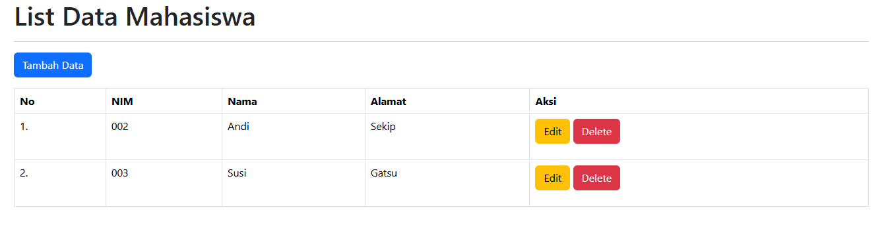
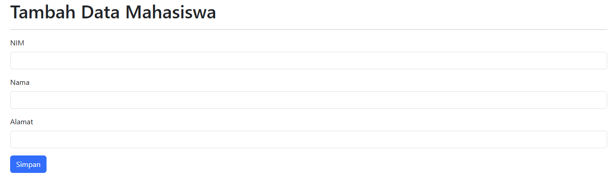
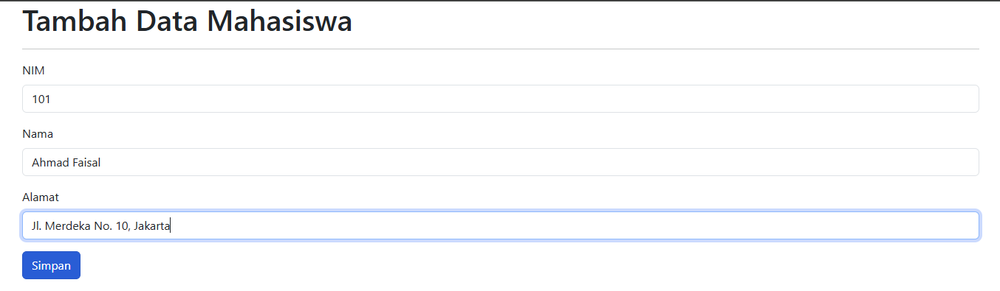
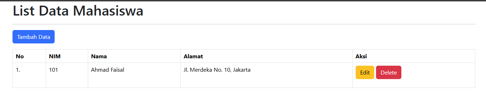
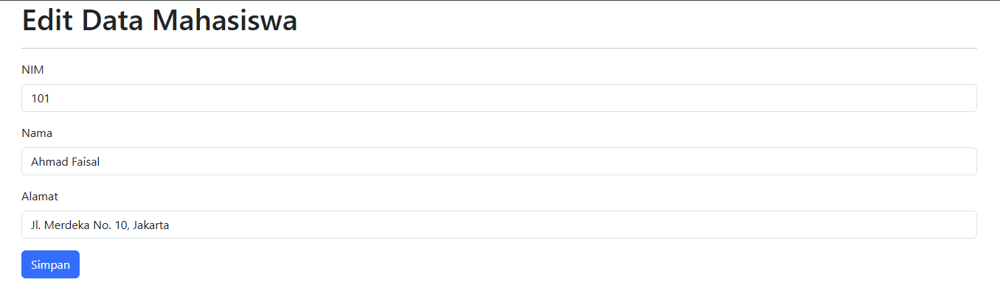
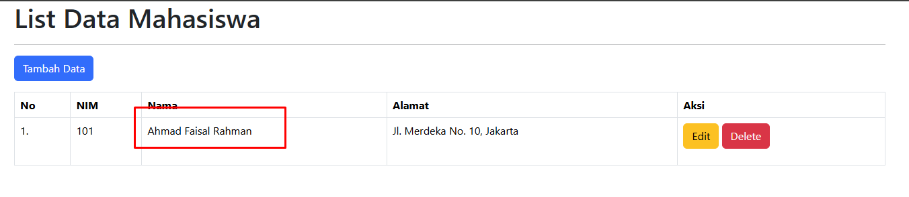
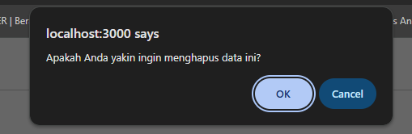

# Tutorial Membuat Aplikasi CRUD Data Mahasiswa Menggunakan Express.js, Handlebars, dan SQLite

## 

## 📋 Daftar Isi

1. [Persiapan dan Instalasi](#1-persiapan-dan-instalasi)
2. [Inisialisasi Project](#2-inisialisasi-project)
3. [Instalasi Dependencies](#3-instalasi-dependencies)
4. [Membuat Struktur Folder](#4-membuat-struktur-folder)
5. [Membuat File Utama (index.js)](#5-membuat-file-utama-indexjs)
6. [Membuat Layout Template](#6-membuat-layout-template)
7. [Membuat Halaman Utama](#7-membuat-halaman-utama)
8. [Membuat Halaman Tambah Data](#8-membuat-halaman-tambah-data)
9. [Membuat Halaman Edit Data](#9-membuat-halaman-edit-data)
10. [Menjalankan Aplikasi](#10-menjalankan-aplikasi)
11. [Testing Aplikasi](#11-testing-aplikasi)

---

## 1. Persiapan dan Instalasi

### Prasyarat

Pastikan Anda telah menginstal:

- **Node.js** (versi 14 atau lebih baru)
  - Node.js adalah JavaScript runtime yang memungkinkan JavaScript berjalan di server (bukan hanya di browser)
  - Built on Chrome's V8 JavaScript engine
  - Download di: [nodejs.org](https://nodejs.org)
  - Recommended: gunakan versi LTS (Long Term Support) untuk stability
- **npm** (Node Package Manager)
  - Package manager untuk JavaScript, otomatis ter-install bersamaan dengan Node.js
  - Digunakan untuk install library/dependencies
  - Alternative: bisa juga pakai **yarn** atau **pnpm**
- **Text Editor** (VSCode, Sublime, dll)
  - Recommended: **Visual Studio Code** (gratis, powerful, banyak extension)
  - Extension VSCode yang berguna untuk Node.js:
    - ESLint (linting)
    - Prettier (code formatting)
    - Handlebars (syntax highlighting untuk .hbs files)
    - npm Intellisense (autocomplete npm modules)
- **Web Browser** (Chrome, Firefox, dll)
  - Recommended: Chrome atau Firefox (developer tools yang lengkap)
  - Install extension: React Developer Tools, Vue.js devtools (untuk project selanjutnya)

### Cek Instalasi Node.js

Buka terminal/command prompt dan jalankan:

```bash
node --version
npm --version
```

**Penjelasan Command:**

- `--version` atau `-v` adalah flag untuk menampilkan versi yang ter-install
- Jika muncul versi number, berarti sudah ter-install dengan benar
- Jika muncul error "command not found", berarti belum ter-install atau belum masuk PATH

**Screenshot 1:** Terminal menampilkan versi Node.js dan npm

```
$ node --version
v18.17.0
$ npm --version
9.6.7
```

---

## 2. Inisialisasi Project

### Langkah 2.1: Membuat Folder Project

```bash
mkdir pertemuan-2
cd pertemuan-2
```

**Penjelasan Command:**

- `mkdir pertemuan-2`: Membuat folder baru dengan nama "pertemuan-2" (make directory)
- `cd pertemuan-2`: Change directory - masuk ke dalam folder tersebut
- Bisa juga menggunakan nama folder lain sesuai keinginan

### Langkah 2.2: Inisialisasi npm

```bash
npm init -y
```

**Penjelasan Command:**

- `npm init`: Command untuk inisialisasi project Node.js, membuat file `package.json`
- Flag `-y` atau `--yes`: Skip semua pertanyaan dan gunakan default value
- Tanpa flag `-y`, npm akan menanyakan:
  - package name
  - version
  - description
  - entry point
  - test command
  - git repository
  - keywords
  - author
  - license
- File `package.json` berisi metadata project dan daftar dependencies
  npm init -y

```

Perintah ini akan membuat file `package.json` secara otomatis dengan konfigurasi default.

```

Wrote to /path/to/pertemuan-2/package.json:
{
"name": "pertemuan-2",
"version": "1.0.0",
...
}

````

---

## 3. Instalasi Dependencies

### Langkah 3.1: Install Dependencies Utama

```bash
npm install express express-handlebars better-sqlite3
````

**Penjelasan Dependencies:**

- **express**: Framework web untuk Node.js yang mempermudah pembuatan server dan pengelolaan routing (URL). Tanpa Express, kita harus menulis banyak kode manual untuk handle HTTP request/response.
- **express-handlebars**: Template engine yang memungkinkan kita membuat file HTML dinamis. Dengan Handlebars, kita bisa memasukkan data dari server ke dalam HTML menggunakan syntax seperti `{{nama_variable}}`. Ini memisahkan logika aplikasi dari tampilan (View).

- **better-sqlite3**: Library database SQLite3 yang ringan dan cepat. SQLite adalah database yang tersimpan dalam satu file saja (tidak perlu install server database terpisah seperti MySQL). Cocok untuk aplikasi kecil dan prototype. Better-sqlite3 lebih cepat daripada library sqlite3 biasa karena menggunakan synchronous API.

### Langkah 3.2: Install Development Dependencies

```bash
npm install --save-dev nodemon
```

**Penjelasan:**

- **nodemon**: Tool development yang sangat berguna. Ketika kita mengubah kode JavaScript, kita biasanya harus menghentikan server (Ctrl+C) dan menjalankan ulang. Nodemon secara otomatis memonitor perubahan file dan me-restart server. Ini hanya digunakan saat development, bukan production.

**Catatan:** Flag `--save-dev` berarti nodemon hanya diperlukan saat development, tidak akan diikutkan saat aplikasi di-deploy ke production.

### Langkah 3.3: Modifikasi package.json

Tambahkan script untuk development. File `package.json` adalah file konfigurasi project Node.js yang berisi informasi metadata project dan dependencies. Bagian `scripts` memungkinkan kita membuat shortcut command:

```json
{
  "name": "pertemuan-2",
  "version": "1.0.0",
  "main": "index.js",
  "scripts": {
    "test": "echo \"Error: no test specified\" && exit 1",
    "dev": "nodemon index.js"
  },
  "dependencies": {
    "better-sqlite3": "^12.6.2",
    "express": "^5.2.1",
    "express-handlebars": "^8.0.2"
  },
  "devDependencies": {
    "nodemon": "^3.1.14"
  }
}
```

**Penjelasan isi package.json:**

- `"name"`: Nama project (otomatis dari nama folder)
- `"version"`: Versi aplikasi (mengikuti Semantic Versioning)
- `"main"`: File entry point aplikasi
- `"scripts"`: Perintah-perintah yang bisa dijalankan dengan `npm run`
  - `"dev"`: Menjalankan aplikasi dengan nodemon untuk development
  - Kita bisa menjalankannya dengan: `npm run dev`
- `"dependencies"`: Library yang dibutuhkan aplikasi untuk berjalan (perlu di production)
- `"devDependencies"`: Library yang hanya dibutuhkan saat development

---

## 4. Membuat Struktur Folder

### Langkah 4.1: Membuat Folder Views

```bash
mkdir views
mkdir views/layouts
mkdir views/mahasiswa
```

**Penjelasan struktur folder:**

- `views/`: Folder utama untuk menyimpan semua file template Handlebars
- `views/layouts/`: Folder untuk menyimpan layout template (struktur HTML dasar yang dipakai bersama)
- `views/mahasiswa/`: Folder khusus untuk halaman-halaman terkait mahasiswa (add dan edit)

Pemisahan folder ini mengikuti prinsip **separation of concerns** - memisahkan file berdasarkan fungsinya agar lebih terorganisir.

### Struktur Folder Akhir:

```
pertemuan-2/
├── index.js
├── package.json
├── views/
│   ├── index.hbs
│   ├── layouts/
│   │   └── main.hbs
│   └── mahasiswa/
│       ├── add.hbs
│       └── edit.hbs
```

---

## 5. Membuat File Utama (index.js)

### Langkah 5.1: Membuat File index.js

Buat file `index.js` di root folder dan tambahkan kode berikut:

```javascript
// import express module
const express = require("express");
// import path module for handling file paths
const path = require("path");
const bodyParser = require("body-parser");

const { engine } = require("express-handlebars");

const DB = require("better-sqlite3");
const db = new DB("mahasiswa.db");

// create mahasiswa table if it doesn't exist
db.exec(`
    CREATE TABLE IF NOT EXISTS mahasiswa (
        nim TEXT PRIMARY KEY,
        nama TEXT NOT NULL,
        alamat TEXT NOT NULL
    )
`);

// set up handlebars as the view engine
const hbs = engine({
  extname: "hbs", // set file extension for handlebars templates
  defaultLayout: "main", // set default layout file
  layoutsDir: path.join(__dirname, "views", "layouts"), // set directory for layout files
  helpers: {
    noUrut: (index) => index + 1, // helper function to generate row numbers in the table
  },
});

// create express app
const app = express();
// parse URL-encoded bodies (for form submissions)
app.use(bodyParser.urlencoded({ extended: false }));

// set handlebars as the view engine for the app
app.engine("hbs", hbs);
app.set("view engine", "hbs");
app.set("views", path.join(__dirname, "views")); // set directory for view templates

// define a route for GET request to '/' => root page
app.get("/", (req, res) => {
  // fetch all mahasiswa records from the database
  const mahasiswa = db.prepare("SELECT * FROM mahasiswa").all();
  res.render("index", {
    mahasiswa, // pass the mahasiswa data to the index.hbs template
  }); // render index.hbs template
});

app.get("/mahasiswa/add", (req, res) => {
  res.render("mahasiswa/add");
});

app.get("/mahasiswa/edit/:nim", (req, res) => {
  const { nim } = req.params; // extract nim from the URL parameters

  const mahasiswa = db
    .prepare("SELECT * FROM mahasiswa WHERE nim = ?")
    .get(nim); // fetch the mahasiswa record with the specified nim from the database

  res.render("mahasiswa/edit", {
    mahasiswa, // pass the mahasiswa data to the edit.hbs template
  });
});

app.post("/mahasiswa/add", (req, res) => {
  // extract nim, nama, and alamat from the request body
  const { nim, nama, alamat } = req.body;

  db.prepare(
    `INSERT INTO mahasiswa (nim, nama, alamat) 
            VALUES (?, ?, ?)`,
  ).run(nim, nama, alamat);

  res.redirect("/"); // redirect to the root page after adding a new mahasiswa
});

app.post("/mahasiswa/edit/:nim", (req, res) => {
  const { nim } = req.params; // extract nim from the URL parameters
  const { nama, alamat } = req.body; // extract nama and alamat from the request body

  db.prepare("UPDATE mahasiswa SET nama = ?, alamat = ? WHERE nim = ?").run(
    nama,
    alamat,
    nim,
  );

  res.redirect("/"); // redirect to the root page after updating the mahasiswa record
});

app.post("/mahasiswa/delete/:nim", (req, res) => {
  const { nim } = req.params; // extract nim from the URL parameters

  db.prepare("DELETE FROM mahasiswa WHERE nim = ?").run(nim); // delete the mahasiswa record with the specified nim from the database

  res.redirect("/"); // redirect to the root page after deleting the mahasiswa record
});

// start the server on port 3000
app.listen(3000, () => {
  console.log("Server is running on http://localhost:3000");
});
```

### Penjelasan Kode index.js:

#### 1. Import Modules

```javascript
const express = require("express");
const path = require("path");
const bodyParser = require("body-parser");
const { engine } = require("express-handlebars");
const DB = require("better-sqlite3");
```

**Penjelasan masing-masing module:**

- `express`: Module utama untuk membuat web server dan routing
- `path`: Module bawaan Node.js untuk handle path file/folder secara cross-platform (Windows menggunakan `\`, Linux/Mac menggunakan `/`)
- `bodyParser`: Middleware untuk mem-parsing data dari form HTML yang dikirim melalui POST request. Data form dikodekan sebagai URL-encoded string, bodyParser mengubahnya menjadi JavaScript object
- `{ engine }`: Mengimport function `engine` dari express-handlebars menggunakan destructuring syntax ES6
- `DB`: Constructor untuk membuat koneksi database SQLite

#### 2. Inisialisasi Database

```javascript
const db = new DB("mahasiswa.db");
db.exec(`
    CREATE TABLE IF NOT EXISTS mahasiswa (
        nim TEXT PRIMARY KEY,
        nama TEXT NOT NULL,
        alamat TEXT NOT NULL
    )
`);
```

**Penjelasan detail:**

- `new DB("mahasiswa.db")`: Membuat/membuka koneksi ke database SQLite. Jika file `mahasiswa.db` belum ada, akan otomatis dibuat. File ini akan tersimpan di root folder project.

- `db.exec()`: Method untuk menjalankan SQL statement. Digunakan untuk operasi yang tidak return data (CREATE, DROP, dll).

- `CREATE TABLE IF NOT EXISTS`: Perintah SQL untuk membuat tabel. `IF NOT EXISTS` memastikan tabel hanya dibuat jika belum ada, sehingga tidak error saat aplikasi di-restart.

- Struktur tabel:
  - `nim TEXT PRIMARY KEY`: Kolom NIM dengan tipe data TEXT dan dijadikan PRIMARY KEY (unique identifier, tidak boleh duplikat, tidak boleh NULL)
  - `nama TEXT NOT NULL`: Kolom nama dengan tipe TEXT, wajib diisi (NOT NULL)
  - `alamat TEXT NOT NULL`: Kolom alamat dengan tipe TEXT, wajib diisi

**Catatan:** SQLite hanya memiliki beberapa tipe data: NULL, INTEGER, REAL, TEXT, BLOB. Dalam praktiknya TEXT bisa menyimpan string dengan panjang apapun.

#### 3. Konfigurasi Handlebars

```javascript
const hbs = engine({
  extname: "hbs",
  defaultLayout: "main",
  layoutsDir: path.join(__dirname, "views", "layouts"),
  helpers: {
    noUrut: (index) => index + 1,
  },
});
```

**Penjelasan konfigurasi:**

- `extname: "hbs"`: Menentukan ekstensi file template yang digunakan. Default-nya `.handlebars`, kita ubah menjadi `.hbs` agar lebih singkat.

- `defaultLayout: "main"`: Menentukan layout default yang akan digunakan semua halaman. File layout adalah "kerangka" HTML yang berisi struktur dasar (header, footer, dll). Setiap halaman akan di-render di dalam layout ini.

- `layoutsDir: path.join(__dirname, "views", "layouts")`: Menentukan lokasi folder layouts. `__dirname` adalah variable global Node.js yang berisi path absolut folder tempat file JavaScript berjalan. `path.join()` menggabungkan path secara cross-platform.

- `helpers`: Object berisi helper functions yang bisa dipanggil di dalam template Handlebars.
  - `noUrut: (index) => index + 1`: Helper function untuk penomoran. Karena array dimulai dari index 0, kita tambah 1 agar penomoran dimulai dari 1.
  - Cara pakai di template: `{{noUrut @index}}`

**Apa itu Helper?** Helper adalah custom function yang bisa kita buat untuk digunakan dalam template Handlebars. Berguna untuk logic sederhana seperti formatting tanggal, penomoran, conditional logic, dll.

#### 4. Konfigurasi Express

```javascript
const app = express();
app.use(bodyParser.urlencoded({ extended: false }));
app.engine("hbs", hbs);
app.set("view engine", "hbs");
app.set("views", path.join(__dirname, "views"));
```

**Penjelasan detail konfigurasi Express:**

- `const app = express()`: Membuat instance Express application. Object `app` ini adalah aplikasi web kita, yang nanti akan digunakan untuk definisi routes, middleware, settings, dll.

- `app.use(bodyParser.urlencoded({ extended: false }))`:
  - `app.use()` memasang middleware yang akan dijalankan untuk setiap request
  - `bodyParser.urlencoded()` mem-parsing data form HTML yang dikirim dengan encoding `application/x-www-form-urlencoded` (format default form HTML)
  - `{ extended: false }` menggunakan library `querystring` untuk parsing (alternatifnya `qs` library jika true)
  - Tanpa middleware ini, `req.body` akan undefined saat kita submit form

- `app.engine("hbs", hbs)`: Mendaftarkan Handlebars sebagai template engine dengan extension ".hbs". Memberitahu Express bahwa file dengan extension .hbs harus di-render menggunakan engine yang sudah kita konfigurasi.

- `app.set("view engine", "hbs")`: Mengatur view engine default menjadi "hbs". Dengan ini, kita tidak perlu menulis extension saat render view (cukup `res.render("index")` tanpa `"index.hbs"`).

- `app.set("views", path.join(__dirname, "views"))`: Mengatur lokasi folder views. Express akan mencari file template di folder ini.

**Apa itu Middleware?** Middleware adalah function yang memproses request sebelum sampai ke route handler. Middleware bisa mengubah request/response object, mengakhiri request-response cycle, atau memanggil middleware berikutnya dalam stack.

#### 5. Routes

**Route GET '/' - Halaman Utama**

```javascript
app.get("/", (req, res) => {
  const mahasiswa = db.prepare("SELECT * FROM mahasiswa").all();
  res.render("index", { mahasiswa });
});
```

**Penjelasan step by step:**

- `app.get("/", ...)`: Mendefinisikan route untuk HTTP GET request ke path "/" (root/homepage)
- `(req, res) => { ... }`: Callback function yang akan dipanggil saat route ini diakses
  - `req` (request): Object yang berisi informasi tentang HTTP request (headers, parameters, body, dll)
  - `res` (response): Object untuk mengirim response ke client

- `db.prepare("SELECT * FROM mahasiswa")`: Membuat prepared statement SQL. Prepared statement lebih aman dari SQL injection dan lebih efisien untuk query yang dijalankan berulang kali.
  - `"SELECT * FROM mahasiswa"`: Query SQL untuk mengambil semua kolom dari semua baris di tabel mahasiswa
- `.all()`: Method untuk mendapatkan semua hasil query dalam bentuk array of objects. Contoh hasilnya:

  ```javascript
  [
    { nim: "101", nama: "Ahmad", alamat: "Jakarta" },
    { nim: "102", nama: "Siti", alamat: "Bandung" },
  ];
  ```

- `res.render("index", { mahasiswa })`: Render template "index.hbs" dan passing data
  - Parameter pertama: nama template ("index" = file views/index.hbs)
  - Parameter kedua: data yang akan dikirim ke template
  - `{ mahasiswa }` adalah shorthand ES6 untuk `{ mahasiswa: mahasiswa }`
  - Data ini bisa diakses di template dengan `{{mahasiswa}}`

**Route GET '/mahasiswa/add' - Halaman Tambah Data**

```javascript
app.get("/mahasiswa/add", (req, res) => {
  res.render("mahasiswa/add");
});
```

**Penjelasan:**

- Route ini menangani HTTP GET request ke path "/mahasiswa/add"
- `res.render("mahasiswa/add")`: Render template yang ada di views/mahasiswa/add.hbs
- Tidak ada data yang di-pass ke template karena ini form kosong untuk input data baru
- Route ini dipanggil saat user klik tombol "Tambah Data" di halaman utama

**Route GET '/mahasiswa/edit/:nim' - Halaman Edit Data**

```javascript
app.get("/mahasiswa/edit/:nim", (req, res) => {
  const { nim } = req.params;
  const mahasiswa = db
    .prepare("SELECT * FROM mahasiswa WHERE nim = ?")
    .get(nim);
  res.render("mahasiswa/edit", { mahasiswa });
});
```

**Penjelasan detail:**

- `"/mahasiswa/edit/:nim"`: Path dengan route parameter. ":nim" adalah placeholder dinamis
  - Contoh URL: `/mahasiswa/edit/101` → :nim akan bernilai "101"
  - Contoh URL: `/mahasiswa/edit/102` → :nim akan bernilai "102"

- `const { nim } = req.params`: Destructuring untuk mengambil nilai parameter dari URL
  - `req.params` adalah object yang berisi semua route parameters
  - Contoh: jika URL adalah `/mahasiswa/edit/101`, maka `req.params = { nim: "101" }`

- `db.prepare("SELECT * FROM mahasiswa WHERE nim = ?")`: Prepared statement dengan placeholder `?`
  - Tanda `?` akan digantikan dengan nilai parameter yang kita berikan
  - Ini mencegah SQL injection karena nilai parameter akan di-escape otomatis

- `.get(nim)`: Method untuk mendapatkan satu baris hasil query
  - Berbeda dengan `.all()` yang return array, `.get()` return satu object atau undefined
  - Nilai `nim` akan menggantikan tanda `?` dalam query
  - Contoh hasil: `{ nim: "101", nama: "Ahmad", alamat: "Jakarta" }`

- `res.render("mahasiswa/edit", { mahasiswa })`: Render form edit dengan data mahasiswa yang sudah ada, sehingga form terisi otomatis dengan data current

**Route POST '/mahasiswa/add' - Proses Tambah Data**

```javascript
app.post("/mahasiswa/add", (req, res) => {
  const { nim, nama, alamat } = req.body;
  db.prepare(`INSERT INTO mahasiswa (nim, nama, alamat) VALUES (?, ?, ?)`).run(
    nim,
    nama,
    alamat,
  );
  res.redirect("/");
});
```

- Menerima data dari form
- Insert data ke database
- Redirect ke halaman utama

**Route POST '/mahasiswa/edit/:nim' - Proses Edit Data**

```javascript
app.post("/mahasiswa/edit/:nim", (req, res) => {
  const { nim } = req.params;
  const { nama, alamat } = req.body;
  db.prepare("UPDATE mahasiswa SET nama = ?, alamat = ? WHERE nim = ?").run(
    nama,
    alamat,
    nim,
  );
  res.redirect("/");
});
```

**Penjelasan detail:**

- Route ini menangani POST request ke "/mahasiswa/edit/:nim"
  - Dipanggil saat user submit form edit
  - NIM diambil dari URL, bukan dari form (karena readonly)

- `const { nim } = req.params`: Mengambil NIM dari URL parameter
  - Contoh: jika URL `/mahasiswa/edit/101`, maka nim = "101"

- `const { nama, alamat } = req.body`: Mengambil data yang diubah dari form
  - NIM tidak diambil dari req.body karena tidak bisa diubah (readonly)
  - Hanya nama dan alamat yang bisa diupdate

- `db.prepare("UPDATE mahasiswa SET nama = ?, alamat = ? WHERE nim = ?")`:
  - `UPDATE mahasiswa`: Statement SQL untuk update data
  - `SET nama = ?, alamat = ?`: Kolom yang akan diupdate dengan nilai baru
  - `WHERE nim = ?`: Kondisi untuk menentukan baris mana yang akan diupdate
  - Tanpa WHERE, semua baris akan terupdate (hati-hati!)

- `.run(nama, alamat, nim)`: Execute update dengan parameter berurutan
  - nama menggantikan ? pertama (SET nama = ?)
  - alamat menggantikan ? kedua (SET alamat = ?)
  - nim menggantikan ? ketiga (WHERE nim = ?)

- `res.redirect("/")`: Kembali ke halaman utama setelah update berhasil

**Route POST '/mahasiswa/delete/:nim' - Proses Hapus Data**

```javascript
app.post("/mahasiswa/delete/:nim", (req, res) => {
  const { nim } = req.params;
  db.prepare("DELETE FROM mahasiswa WHERE nim = ?").run(nim);
  res.redirect("/");
});
```

**Penjelasan detail:**

- Route untuk menghapus data mahasiswa
  - Menggunakan POST method, bukan GET, karena operasi ini mengubah data di server
  - GET seharusnya hanya untuk operasi read-only

- `const { nim } = req.params`: Mengambil NIM dari URL parameter
  - NIM data yang akan dihapus ada di URL, bukan di form body

- `db.prepare("DELETE FROM mahasiswa WHERE nim = ?")`: Prepared statement untuk DELETE
  - `DELETE FROM mahasiswa`: Perintah SQL untuk hapus data dari tabel mahasiswa
  - `WHERE nim = ?`: Kondisi untuk menentukan baris mana yang akan dihapus
  - **PENTING:** Selalu gunakan WHERE saat DELETE, tanpa WHERE semua data akan terhapus!

- `.run(nim)`: Execute delete operation
  - nim menggantikan placeholder ?
  - Return value berisi changes (jumlah baris yang terhapus)
  - Jika nim tidak ditemukan, changes akan bernilai 0 (tidak error)

- `res.redirect("/")`: Redirect ke halaman utama
  - User akan melihat data terbaru tanpa data yang sudah dihapus

**Catatan Keamanan:** Dalam aplikasi production, sebaiknya tambahkan konfirmasi di backend dan authorization untuk memastikan user berhak menghapus data tersebut.

#### 6. Start Server

```javascript
app.listen(3000, () => {
  console.log("Server is running on http://localhost:3000");
});
```

**Penjelasan:**

- `app.listen(port, callback)`: Method untuk menjalankan server
  - Parameter pertama (3000): Port number tempat server akan listen for connections
  - Port adalah "pintu" di komputer untuk komunikasi jaringan
  - Range port: 0-65535, tapi 0-1023 reserved untuk system
  - Port 3000 adalah convention untuk development Node.js (bisa diganti sesuai kebutuhan)
- Callback function: Dipanggil setelah server berhasil start
  - Digunakan untuk menampilkan pesan konfirmasi
  - Opsional, tapi berguna untuk debugging

- Setelah `app.listen()` dipanggil, server akan "mendengarkan" request HTTP yang masuk
- Program tidak akan terminate, akan terus berjalan sampai kita stop (Ctrl+C)

**Cara akses:** Buka browser dan ketik `http://localhost:3000`

- `localhost` = komputer sendiri (127.0.0.1)
- `3000` = port number

---

## 6. Membuat Layout Template

### Langkah 6.1: Membuat File main.hbs

Buat file `views/layouts/main.hbs`:

```handlebars
<html lang="en">
  <head>
    <meta charset="UTF-8" />
    <meta name="viewport" content="width=device-width, initial-scale=1.0" />
    <title>Program Input Data Mahasiswa</title>
    <link
      href="https://cdn.jsdelivr.net/npm/bootstrap@5.3.8/dist/css/bootstrap.min.css"
      rel="stylesheet"
      integrity="sha384-sRIl4kxILFvY47J16cr9ZwB07vP4J8+LH7qKQnuqkuIAvNWLzeN8tE5YBujZqJLB"
      crossorigin="anonymous"
    />
  </head>
  <body>
    <div class="container">
      {{{body}}}
    </div>
  </body>
</html>
```

### Penjelasan:

**Apa itu Layout?**
Layout adalah template "kerangka" yang berisi struktur HTML dasar (head, body, dll) yang sama untuk semua halaman. Dengan layout, kita tidak perlu menulis ulang struktur HTML yang sama di setiap halaman. Setiap halaman hanya perlu menulis konten uniknya saja.

**Penjelasan elemen-elemen:**

- `<html lang="en">`: Tag root HTML dengan bahasa English

- `<meta charset="UTF-8" />`: Set character encoding UTF-8 (support semua karakter internasional)

- `<meta name="viewport" ...>`: Penting untuk responsive design. Memberitahu browser untuk adjust ukuran content sesuai device width (mobile-friendly).

- `<title>`: Judul yang muncul di tab browser

- `<link href="https://cdn.jsdelivr.net/npm/bootstrap@5.3.8/...">`: Load Bootstrap CSS dari CDN (Content Delivery Network)
  - CDN adalah server eksternal yang hosting library populer
  - Lebih cepat daripada download sendiri karena kemungkinan browser sudah cache dari website lain
  - Attribute `integrity` dan `crossorigin` untuk keamanan (mencegah file di-modifikasi)

- `<div class="container">`: Class Bootstrap yang memberikan:
  - Max-width responsive (lebar menyesuaikan ukuran layar)
  - Padding kiri-kanan
  - Margin auto (center horizontal)

- `{{{body}}}`: Triple curly braces untuk unescaped HTML
  - Ini adalah placeholder yang akan diganti dengan konten dari halaman individual (index.hbs, add.hbs, edit.hbs)
  - Triple braces `{{{ }}}` digunakan agar HTML tidak di-escape (berbeda dengan double braces `{{ }}` yang escape HTML)
  - Saat render halaman, konten halaman akan menggantikan `{{{body}}}`

**Bagaimana cara kerjanya?**
Ketika kita melakukan `res.render("index", data)`, Express-Handlebars akan:

1. Render index.hbs dengan data yang diberikan
2. Masukkan hasil render ke dalam main.hbs menggantikan `{{{body}}}`
3. Kirim HTML lengkap ke browser

---

## 7. Membuat Halaman Utama

### Langkah 7.1: Membuat File index.hbs

Buat file `views/index.hbs`:

```handlebars
<h1>List Data Mahasiswa</h1>
<hr />
<a href="/mahasiswa/add" class="btn btn-primary mb-3">Tambah Data</a>
<table class="table table-bordered">
  <thead>
    <tr>
      <th>No</th>
      <th>NIM</th>
      <th>Nama</th>
      <th>Alamat</th>
      <th>Aksi</th>
    </tr>
  </thead>
  <tbody>
    {{#each mahasiswa}}
      <tr>
        <td>{{noUrut @index}}.</td>
        <td>{{this.nim}}</td>
        <td>{{this.nama}}</td>
        <td>{{this.alamat}}</td>
        <td>
          <a
            href="/mahasiswa/edit/{{this.nim}}"
            class="btn btn-warning"
          >Edit</a>
          <form
            action="/mahasiswa/delete/{{this.nim}}"
            method="POST"
            style="display: inline-block;"
          >
            <button
              type="submit"
              class="btn btn-danger"
              onclick="return confirm('Apakah Anda yakin ingin menghapus data ini?')"
            >
              Delete</button>
          </form>
        </td>
      </tr>
    {{/each}}
  </tbody>
</table>
```

### Penjelasan:

**Struktur Halaman:**

- `<h1>List Data Mahasiswa</h1>`: Heading utama halaman
- `<hr />`: Horizontal rule (garis pemisah)

**Button Tambah Data:**

- `<a href="/mahasiswa/add" class="btn btn-primary mb-3">`: Link yang di-styling seperti button
  - `href="/mahasiswa/add"`: Link ke halaman tambah data
  - `class="btn btn-primary"`: Class Bootstrap untuk button biru
  - `mb-3`: Margin bottom (spacing ke elemen di bawahnya)

**Tabel Data:**

- `<table class="table table-bordered">`: Tabel dengan border
  - `table`: Class Bootstrap untuk styling tabel
  - `table-bordered`: Menambahkan border pada semua cell

- `<thead>`: Table head (header tabel)
- `<th>`: Table header cell untuk judul kolom

**Handlebars Syntax:**

- `{{#each mahasiswa}}...{{/each}}`: Block helper untuk looping
  - Looping melalui array mahasiswa yang di-pass dari controller
  - Setiap iterasi, data mahasiswa tersedia di dalam block
  - Jika array kosong, block tidak akan di-render

- `{{noUrut @index}}`: Memanggil helper function `noUrut` dengan parameter `@index`
  - `@index` adalah variable special Handlebars yang berisi index array (0, 1, 2, ...)
  - Helper `noUrut` menambah 1 sehingga jadi 1, 2, 3, ...
  - Dot (.) di akhir adalah literal text yang ditulis langsung

- `{{this.nim}}`, `{{this.nama}}`, `{{this.alamat}}`: Mengakses property dari object current iteration
  - `this` merujuk ke item mahasiswa pada iterasi saat ini
  - Bisa juga ditulis tanpa `this`: `{{nim}}`, `{{nama}}`, `{{alamat}}`

**Button Edit:**

- `<a href="/mahasiswa/edit/{{this.nim}}" class="btn btn-warning">`: Link ke halaman edit
  - URL dinamis: jika nim = "101", akan jadi `/mahasiswa/edit/101`
  - `btn-warning`: Button kuning (Bootstrap color)

**Form Delete:**

- Form inline dengan method POST untuk delete data
- `action="/mahasiswa/delete/{{this.nim}}"`: URL target dengan NIM dinamis
- `method="POST"`: HTTP method POST (tidak bisa GET karena GET tidak boleh ubah data)
- `style="display: inline-block;"`: Agar form dan button Edit sejajar (inline)

- `<button type="submit" ... onclick="return confirm('...')">`: Button submit dengan konfirmasi
  - `onclick="return confirm('...')"`: JavaScript untuk menampilkan dialog confirm browser
  - Jika user klik "Cancel", akan return false dan form tidak submit
  - Jika user klik "OK", akan return true dan form submit
  - `btn-danger`: Button merah (Bootstrap color untuk action berbahaya)

**Catatan Penting:**

- Tidak ada data? Tabel akan tetap muncul dengan header saja (tbody kosong)
- Jika ingin pesan "Tidak ada data", bisa tambahkan: `{{else}}` di dalam `{{#each}}...{{else}}...{{/each}}`

---

## 8. Membuat Halaman Tambah Data

### Langkah 8.1: Membuat File add.hbs

Buat file `views/mahasiswa/add.hbs`:

```handlebars
<h1>Tambah Data Mahasiswa</h1>
<hr />
<form action="/mahasiswa/add" method="POST">
  <div class="mb-3">
    <label for="nim" class="form-label">NIM</label>
    <input type="text" class="form-control" id="nim" name="nim" required />
  </div>
  <div class="mb-3">
    <label for="nama" class="form-label">Nama</label>
    <input type="text" class="form-control" id="nama" name="nama" required />
  </div>
  <div class="mb-3">
    <label for="alamat" class="form-label">Alamat</label>
    <input
      type="text"
      class="form-control"
      id="alamat"
      name="alamat"
      required
    />
  </div>
  <button type="submit" class="btn btn-primary">Simpan</button>
</form>
```

### Penjelasan:

**Form HTML:**

- `<form action="/mahasiswa/add" method="POST">`: Tag form untuk input data
  - `action="/mahasiswa/add"`: URL tujuan saat form di-submit. Harus match dengan route di index.js
  - `method="POST"`: HTTP method yang digunakan. POST untuk mengirim data sensitif/banyak
  - Saat submit, browser akan mengirim POST request ke `/mahasiswa/add` dengan data form

**Structure Form Bootstrap:**

- `<div class="mb-3">`: Wrapper untuk setiap form group
  - `mb-3`: Margin bottom class Bootstrap (spacing antar input)

- `<label for="nim" class="form-label">`: Label untuk input
  - `for="nim"`: Menghubungkan label dengan input (saat label di-klik, input akan focus)
  - `class="form-label"`: Bootstrap styling untuk label

- `<input type="text" class="form-control" id="nim" name="nim" required />`: Input field
  - `type="text"`: Tipe input text biasa (bisa diganti `number`, `email`, dll)
  - `class="form-control"`: Bootstrap class untuk styling input (border, padding, dll)
  - `id="nim"`: ID unik untuk input, harus match dengan `for` di label
  - `name="nim"`: **PENTING!** Ini adalah key yang akan digunakan di `req.body.nim` di backend
  - `required`: HTML5 validation - form tidak bisa di-submit jika kosong

**Tiga Input Fields:**

1. **NIM**: Nomor Induk Mahasiswa (akan jadi primary key)
2. **Nama**: Nama lengkap mahasiswa
3. **Alamat**: Alamat mahasiswa

**Button Submit:**

- `<button type="submit" class="btn btn-primary">`: Button untuk submit form
  - `type="submit"`: Saat di-klik, akan trigger form submission
  - Alternative: bisa pakai `<input type="submit" value="Simpan" />`
  - `btn-primary`: Bootstrap blue button

**Flow Submit Form:**

1. User isi form dan klik "Simpan"
2. Browser validasi (required fields tidak boleh kosong)
3. Browser kirim POST request ke `/mahasiswa/add`
4. Data dikirim sebagai URL-encoded: `nim=101&nama=Ahmad&alamat=Jakarta`
5. bodyParser middleware di Express meng-parse menjadi object: `{ nim: "101", nama: "Ahmad", alamat: "Jakarta" }`
6. Data tersedia di `req.body` di route handler
7. Route handler insert data ke database dan redirect

**Kenapa tidak pakai GET?**
GET tidak cocok untuk form karena:

- Data tampil di URL (tidak private)
- URL ada batasan panjang
- GET seharusnya read-only (idempotent)

---

## 9. Membuat Halaman Edit Data

### Langkah 9.1: Membuat File edit.hbs

Buat file `views/mahasiswa/edit.hbs`:

```handlebars
<h1>Edit Data Mahasiswa</h1>
<hr />
<form action="/mahasiswa/edit/{{mahasiswa.nim}}" method="POST">
  <div class="mb-3">
    <label for="nim" class="form-label">NIM</label>
    <input
      type="text"
      class="form-control"
      id="nim"
      name="nim"
      required
      value="{{mahasiswa.nim}}"
      readonly
    />
  </div>
  <div class="mb-3">
    <label for="nama" class="form-label">Nama</label>
    <input
      type="text"
      class="form-control"
      id="nama"
      name="nama"
      required
      value="{{mahasiswa.nama}}"
    />
  </div>
  <div class="mb-3">
    <label for="alamat" class="form-label">Alamat</label>
    <input
      type="text"
      class="form-control"
      id="alamat"
      name="alamat"
      required
      value="{{mahasiswa.alamat}}"
    />
  </div>
  <button type="submit" class="btn btn-primary">Simpan</button>
</form>
```

### Penjelasan:

**Perbedaan dengan add.hbs:**

1. **Form Action Dinamis:**
   - `action="/mahasiswa/edit/{{mahasiswa.nim}}"`: URL action yang mengandung NIM
   - Contoh: jika nim = "101", action jadi `/mahasiswa/edit/101`
   - NIM diambil dari data mahasiswa yang di-pass dari controller

2. **Input dengan Value:**
   - `value="{{mahasiswa.nim}}"`: Mengisi input dengan data yang sudah ada
   - `value="{{mahasiswa.nama}}"`: Form terisi otomatis (pre-filled)
   - `value="{{mahasiswa.alamat}}"`: User bisa langsung edit tanpa ketik ulang

3. **NIM Read-only:**
   - `<input ... value="{{mahasiswa.nim}}" readonly />`: NIM tidak bisa diubah
   - Attribute `readonly` membuat input tidak bisa di-edit (greyed out)
   - **Kenapa read-only?** Karena NIM adalah PRIMARY KEY di database
   - Primary key tidak boleh diubah karena digunakan sebagai identifier unik
   - Jika perlu ubah NIM, seharusnya delete data lama dan create data baru

4. **Nama dan Alamat Editable:**
   - Input nama dan alamat tidak readonly, bisa diubah
   - User tinggal modifikasi text yang sudah ada

**Flow Edit Data:**

1. User klik button "Edit" di halaman utama
2. Browser request GET `/mahasiswa/edit/101`
3. Controller query database berdasarkan NIM
4. Controller render edit.hbs dengan data mahasiswa
5. Form muncul dengan fields sudah terisi
6. User ubah nama/alamat dan klik "Simpan"
7. Browser submit POST `/mahasiswa/edit/101` dengan data baru
8. Controller update database WHERE nim = ?
9. Controller redirect ke halaman utama
10. User melihat data yang sudah terupdate

**Kenapa NIM di URL dan di Form?**

- NIM di URL: Digunakan untuk WHERE clause (menentukan data mana yang diupdate)
- NIM di form (readonly): Hanya untuk display, supaya user tahu data mana yang sedang diedit
- NIM tidak dikirim dari req.body, hanya dari req.params

**Alternatif: Hidden Input**
Bisa juga menggunakan hidden input tanpa menampilkan NIM:

```html
<input type="hidden" name="nim" value="{{mahasiswa.nim}}" />
```

Tapi lebih baik tampilkan NIM (readonly) agar user tahu data mana yang sedang diedit.

---

## 10. Menjalankan Aplikasi

### Langkah 10.1: Menjalankan Server

Buka terminal di folder project dan jalankan:

```bash
npm run dev
```

**Penjelasan:**

- `npm run dev`: Menjalankan script "dev" yang sudah kita definisikan di package.json
- Script "dev" akan execute: `nodemon index.js`
- Nodemon akan menjalankan file index.js dan memonitor perubahan file
- Server akan otomatis restart jika ada file yang berubah

**Alternative tanpa nodemon:**

```bash
node index.js
```

- Tapi dengan ini, harus manual stop (Ctrl+C) dan start lagi setiap kali ada perubahan code

```
[nodemon] 3.1.14
[nodemon] to restart at any time, enter `rs`
[nodemon] watching path(s): *.*
[nodemon] watching extensions: js,mjs,cjs,json
[nodemon] starting `node index.js`
Server is running on http://localhost:3000
```

**Penjelasan Output:**

- `[nodemon] 3.1.14`: Versi nodemon yang digunakan
- `to restart at any time, enter 'rs'`: Ketik `rs` + Enter untuk manual restart
- `watching path(s): *.*`: Nodemon memonitor semua file di folder
- `watching extensions: ...`: File extension yang dimonitor
- `starting 'node index.js'`: Command yang dijalankan nodemon
- `Server is running...`: Output dari console.log di index.js kita

**Troubleshooting:**

- Port sudah dipakai: Ubah port di index.js atau kill process yang pakai port 3000
- Module not found: Jalankan `npm install` untuk install dependencies
- Permission denied: Di Linux/Mac, mungkin perlu `sudo npm run dev` atau fix permission

### Langkah 10.2: Buka Browser

Buka browser dan akses:

```
http://localhost:3000
```

**Penjelasan URL:**

- `http://`: Protocol (Hypertext Transfer Protocol)
- `localhost`: Hostname yang merujuk ke komputer sendiri (127.0.0.1)
- `3000`: Port number tempat server berjalan
- Alternative: bisa juga pakai `http://127.0.0.1:3000`


**Yang Akan Muncul:**

- Judul "List Data Mahasiswa"
- Button "Tambah Data" (berwarna biru)
- Tabel dengan header: No, NIM, Nama, Alamat, Aksi
- Tbody kosong (belum ada data)

**Catatan:**

- Jangan close terminal, biarkan server tetap running
- Jika ada error, cek terminal untuk melihat error message
- Browser auto-complete URL karena sering dipakai

---

## 11. Testing Aplikasi

### Test 1: Menambah Data Pertama

#### Langkah 11.1: Klik Tombol "Tambah Data"



**Apa yang Terjadi di Balik Layar:**

1. Browser mengirim GET request ke `/mahasiswa/add`
2. Express matching request dengan route: `app.get("/mahasiswa/add", ...)`
3. Route handler render template `mahasiswa/add.hbs`
4. Handlebars compile template dan inject ke layout `main.hbs`
5. HTML lengkap dikirim ke browser
6. Browser render HTML dan tampilkan form kosong

#### Langkah 11.2: Isi Form

- NIM: `101`
- Nama: `Ahmad Faisal`
- Alamat: `Jl. Merdeka No. 10, Jakarta`



**Tips Pengisian:**

- NIM harus unique (tidak boleh duplikat)
- Semua field harus diisi (karena required)
- Browser akan validasi sebelum submit

#### Langkah 11.3: Klik "Simpan"



```
List Data Mahasiswa
[Tambah Data]

No  NIM   Nama            Alamat                        Aksi
1.  101   Ahmad Faisal    Jl. Merdeka No. 10, Jakarta  [Edit] [Delete]
```

**Apa yang Terjadi di Balik Layar:**

1. Browser validasi form (semua required field terisi?)
2. Browser serialize form data: `nim=101&nama=Ahmad+Faisal&alamat=Jl.+Merdeka+No.+10%2C+Jakarta`
3. Browser kirim POST request ke `/mahasiswa/add` dengan data di body
4. Express routing: match dengan `app.post("/mahasiswa/add", ...)`
5. bodyParser middleware parse data jadi object: `{ nim: "101", nama: "Ahmad Faisal", alamat: "Jl. Merdeka No. 10, Jakarta" }`
6. Route handler ambil data dari `req.body`
7. Execute SQL: `INSERT INTO mahasiswa (nim, nama, alamat) VALUES ("101", "Ahmad Faisal", "Jl. Merdeka No. 10, Jakarta")`
8. Data tersimpan di database (file mahasiswa.db bertambah ukurannya)
9. Server respond dengan redirect: `HTTP 302 Found, Location: /`
10. Browser otomatis follow redirect, kirim GET request ke `/`
11. Route handler query database: `SELECT * FROM mahasiswa`
12. Hasil query (array dengan 1 item) di-pass ke template
13. Template render tabel dengan data
14. Browser tampilkan halaman utama dengan data baru

**Cek Database:**
Bisa cek isi database menggunakan SQLite browser atau command:

```bash
sqlite3 mahasiswa.db "SELECT * FROM mahasiswa;"
```

### Test 2: Menambah Data Kedua

#### Langkah 11.4: Tambah data lagi

- NIM: `102`
- Nama: `Siti Nurhaliza`
- Alamat: `Jl. Sudirman No. 25, Bandung`

```
No  NIM   Nama             Alamat                         Aksi
1.  101   Ahmad Faisal     Jl. Merdeka No. 10, Jakarta   [Edit] [Delete]
2.  102   Siti Nurhaliza   Jl. Sudirman No. 25, Bandung  [Edit] [Delete]
```

**Observasi:**

- Penomoran otomatis: 1, 2 (thanks to helper `noUrut`)
- Data diurutkan sesuai urutan insert (SQLite tidak ada default ordering)
- Setiap baris punya button Edit dan Delete sendiri

### Test 3: Edit Data

#### Langkah 11.5: Klik "Edit" pada data pertama



**Apa yang Terjadi di Balik Layar:**

1. Browser kirim GET request ke `/mahasiswa/edit/101`
2. Express routing extract parameter: `req.params.nim = "101"`
3. Route handler query database: `SELECT * FROM mahasiswa WHERE nim = "101"`
4. Database return 1 row: `{ nim: "101", nama: "Ahmad Faisal", alamat: "Jl. Merdeka No. 10, Jakarta" }`
5. Data di-pass ke template `mahasiswa/edit.hbs`
6. Template render form dengan value pre-filled
7. Input NIM readonly (tidak bisa diubah)
8. Browser tampilkan form

#### Langkah 11.6: Ubah Nama

- Nama: `Ahmad Faisal Rahman` (tambahkan "Rahman")
- Klik "Simpan"



```
No  NIM   Nama                  Alamat                         Aksi
1.  101   Ahmad Faisal Rahman   Jl. Merdeka No. 10, Jakarta   [Edit] [Delete]
2.  102   Siti Nurhaliza        Jl. Sudirman No. 25, Bandung  [Edit] [Delete]
```

**Apa yang Terjadi di Balik Layar:**

1. User ubah nama dan klik "Simpan"
2. Browser kirim POST request ke `/mahasiswa/edit/101`
3. Express routing extract: `req.params.nim = "101"`
4. bodyParser parse form: `req.body = { nama: "Ahmad Faisal Rahman", alamat: "Jl. Merdeka No. 10, Jakarta" }`
5. Note: NIM tidak ada di req.body karena input readonly (tapi tetap visible di form)
6. Route handler execute SQL: `UPDATE mahasiswa SET nama = "Ahmad Faisal Rahman", alamat = "Jl. Merdeka No. 10, Jakarta" WHERE nim = "101"`
7. SQLite update 1 row di database
8. Server respond dengan redirect ke `/`
9. Browser follow redirect dan tampilkan data terbaru
10. Nama sudah berubah dari "Ahmad Faisal" jadi "Ahmad Faisal Rahman"

**Kenapa Redirect?**

- PRG Pattern (Post-Redirect-Get)
- Mencegah duplicate submission jika user refresh browser
- Best practice untuk form yang mengubah data

### Test 4: Hapus Data

#### Langkah 11.7: Klik "Delete" pada data kedua



```
Apakah Anda yakin ingin menghapus data ini?
[OK] [Cancel]
```

**JavaScript Confirmation:**

- Dialog ini dipicu oleh `onclick="return confirm('...')"`
- Native browser dialog (tidak bisa di-customize style-nya)
- Jika user klik "Cancel", return false → form tidak submit
- Jika user klik "OK", return true → form submit

#### Langkah 11.8: Klik "OK"

```
No  NIM   Nama                  Alamat                         Aksi
1.  101   Ahmad Faisal Rahman   Jl. Merdeka No. 10, Jakarta   [Edit] [Delete]
```

**Apa yang Terjadi di Balik Layar:**

1. User klik "OK" di confirmation dialog
2. Browser submit form: POST request ke `/mahasiswa/delete/102`
3. Express routing extract: `req.params.nim = "102"`
4. Route handler execute SQL: `DELETE FROM mahasiswa WHERE nim = "102"`
5. SQLite hapus 1 row dari database
6. File mahasiswa.db size berkurang
7. Server respond dengan redirect ke `/`
8. Browser follow redirect dan query data terbaru
9. Data dengan NIM 102 (Siti Nurhaliza) sudah tidak ada
10. Penomoran otomatis adjust: yang tadinya row 1 tetap row 1

**Catatan Penting:**

- DELETE adalah operasi destructive (tidak bisa undo)
- Data benar-benar hilang dari database
- Dalam aplikasi production, consider "soft delete" (mark as deleted, tidak benar-benar dihapus)
- Best practice: tambahkan authorization (user hanya bisa delete data miliknya)

---

## 🗂️ Struktur Database

### Tabel: mahasiswa

| Kolom  | Tipe Data | Constraint  |
| ------ | --------- | ----------- |
| nim    | TEXT      | PRIMARY KEY |
| nama   | TEXT      | NOT NULL    |
| alamat | TEXT      | NOT NULL    |

---

---

## 📝 Catatan Penting

1. **SQLite Database**:
   - File `mahasiswa.db` akan otomatis dibuat di folder project saat pertama kali aplikasi dijalankan
   - Database tersimpan dalam satu file, mudah untuk backup (tinggal copy file)
   - Cocok untuk development dan aplikasi kecil
   - Untuk production dengan traffic tinggi, pertimbangkan MySQL/PostgreSQL

2. **Nodemon**:
   - Saat menggunakan `npm run dev`, server akan otomatis restart setiap kali ada perubahan kode
   - Nodemon memonitor file dengan extension: .js, .mjs, .cjs, .json
   - Untuk manual restart saat nodemon running, ketik `rs` di terminal dan Enter
   - Jika ingin ignore certain files, buat file `nodemon.json` dengan konfigurasi

3. **Body Parser**:
   - Middleware ini diperlukan untuk membaca data dari form HTML
   - Tanpa bodyParser, `req.body` akan undefined
   - Starting Express 4.16.0, bisa pakai built-in: `express.urlencoded({ extended: false })`
   - Untuk JSON data, gunakan `express.json()`

4. **Handlebars Helpers**:
   - Helper `noUrut` digunakan untuk penomoran baris di tabel
   - Kita bisa membuat helper lain seperti: formatDate, capitalize, ifEqual, dll
   - Helper sangat berguna untuk logic sederhana yang sering dipakai
   - Example custom helper:
     ```javascript
     helpers: {
       formatDate: (date) => new Date(date).toLocaleDateString('id-ID'),
       uppercase: (str) => str.toUpperCase()
     }
     ```

5. **Primary Key**:
   - NIM dijadikan primary key sehingga tidak boleh ada NIM yang sama
   - Jika insert NIM duplikat, SQLite akan throw error
   - Primary key automatically indexed untuk query cepat
   - Sebaiknya primary key tidak pernah diubah setelah dibuat

6. **Readonly Input**:
   - Input NIM di halaman edit dibuat readonly karena primary key tidak boleh diubah
   - Alternative: gunakan hidden input dan tampilkan NIM sebagai text biasa (non-editable)
   - Readonly input masih terkirim saat form submit (berbeda dengan disabled)

7. **Confirmation Dialog**:
   - Menggunakan JavaScript `confirm()` untuk konfirmasi sebelum menghapus data
   - Ini adalah browser native dialog, tidak terlalu bagus secara UI/UX
   - Untuk aplikasi production, gunakan modal confirmation yang lebih menarik (e.g., Bootstrap Modal, SweetAlert)
   - Dialog confirm hanya protection di client-side, server tetap harus validate

8. **HTTP Methods**:
   - **GET** untuk menampilkan halaman (read-only, idempotent, bisa di-bookmark)
   - **POST** untuk mengirim data (create, update, delete) - tidak idempotent
   - GET request bisa di-cache oleh browser, POST tidak
   - RESTful best practice:
     - POST untuk CREATE
     - PUT/PATCH untuk UPDATE
     - DELETE untuk DELETE
   - Tapi karena HTML form hanya support GET & POST, kita pakai POST untuk semua operasi yang mengubah data

9. **Security Considerations**:
   - Aplikasi ini masih sangat basic, tidak ada authentication/authorization
   - Prepared statements melindungi dari SQL injection
   - Tidak ada validation di backend (hanya HTML5 validation)
   - Tidak ada error handling (try-catch)
   - Untuk production, perlu tambahan:
     - Input validation & sanitization
     - CSRF protection
     - Rate limiting
     - Proper error handling
     - Logging

10. **Database Connection**:
    - SQLite connection synchronous (blocking)
    - Untuk production, gunakan database dengan async driver (MySQL, PostgreSQL)
    - Atau gunakan ORM seperti Sequelize, Prisma untuk abstraction lebih baik

---

## 🎯 Fitur Aplikasi

✅ **Create** - Menambah data mahasiswa baru  
✅ **Read** - Menampilkan list data mahasiswa  
✅ **Update** - Mengubah data mahasiswa  
✅ **Delete** - Menghapus data mahasiswa  
✅ **Validasi Form** - Input required  
✅ **Konfirmasi Delete** - Mencegah penghapusan tidak sengaja  
✅ **Responsive Design** - Menggunakan Bootstrap 5  
✅ **Auto Numbering** - Penomoran otomatis di tabel

---

## 📚 Teknologi yang Digunakan

- **Node.js** - Runtime environment JavaScript
- **Express.js** - Web framework untuk Node.js
- **Express-Handlebars** - Template engine
- **Better-SQLite3** - SQLite database untuk Node.js
- **Bootstrap 5** - CSS framework untuk UI
- **Nodemon** - Development tool untuk auto-restart

---

## 🎓 Kesimpulan

Selamat! Anda telah berhasil membuat aplikasi CRUD sederhana menggunakan:

- **Express.js** untuk routing dan web server
- **Handlebars** untuk templating HTML
- **SQLite** untuk database
- **Bootstrap** untuk styling

Aplikasi ini mendemonstrasikan konsep dasar:

- **Routing** (GET dan POST)
  - GET untuk menampilkan halaman (read)
  - POST untuk operasi yang mengubah data (create, update, delete)
  - Dynamic routing dengan parameters (`:nim`)

- **Database Operations** (SELECT, INSERT, UPDATE, DELETE)
  - Prepared statements untuk keamanan
  - Primary key untuk unique identifier
  - WHERE clause untuk filtering data

- **Template Engine** (Handlebars dengan layouts dan helpers)
  - Layout untuk struktur HTML yang reusable
  - Partial templates untuk komponen
  - Helpers untuk logic sederhana
  - Block helpers untuk looping dan conditional

- **Form Handling** (submit, validation)
  - POST method untuk form submission
  - bodyParser untuk parsing form data
  - HTML5 validation (required attribute)
  - Server-side processing (req.body)

- **MVC Pattern** (Model-View-Controller sederhana)
  - **Model**: Database layer (better-sqlite3)
  - **View**: Template files (.hbs)
  - **Controller**: Route handlers (di index.js)
  - Pemisahan concerns untuk code organization yang lebih baik

**Konsep Penting yang Sudah Dipelajari:**

1. **Request-Response Cycle**: Bagaimana browser berkomunikasi dengan server
2. **Middleware**: Function yang memproses request sebelum sampai ke route handler
3. **Template Rendering**: Mengubah data menjadi HTML menggunakan template engine
4. **Database CRUD**: Create, Read, Update, Delete operations
5. **RESTful Routing**: Penamaan route yang konsisten dan meaningful
6. **Separation of Concerns**: Memisahkan logic, data, dan presentation

**Next Steps untuk Pembelajaran:**

- Pelajari **async/await** dan **Promises** untuk asynchronous operations
- Eksplorasi **Express middleware** lebih dalam (error handling, logging, authentication)
- Coba database lain: **MongoDB** (NoSQL), **PostgreSQL** (SQL)
- Pelajari **ORM/ODM**: Sequelize, Prisma, Mongoose
- Implementasi **REST API** (return JSON instead of HTML)
- Tambahkan **authentication** dengan session atau JWT
- Deploy aplikasi ke cloud: **Heroku**, **Vercel**, **Railway**

Selamat! Anda sudah memahami dasar-dasar pembuatan web aplikasi dengan Node.js! 🎉

**Tips:**

- Practice makes perfect - coba buat CRUD untuk entitas lain (buku, produk, dll)
- Baca dokumentasi resmi: expressjs.com, handlebarsjs.com
- Explore source code project open source untuk belajar best practices
- Join komunitas Node.js Indonesia untuk diskusi dan tanya jawab
